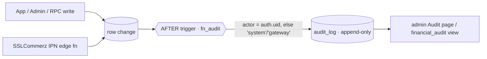

# Audit Log — Plan

Status: **Phase 1 + Phase 2 applied to live** (2026-08-08).
- [089_audit_log.sql](../supabase/migrations/089_audit_log.sql) — table, RLS, immutability guard, `fn_audit`, triggers on payments/bookings/app_settings/owner_documents/profiles, `financial_audit` view. Applied + recorded; verified live (trigger fires, rolled-back smoke test).
- [090_audit_log_phase2.sql](../supabase/migrations/090_audit_log_phase2.sql) — triggers on coupons / coupon_redemptions / reports. Applied + recorded.
- Admin portal **Audit** page (`/audit`, read-only, category filter) + nav link. tsc/eslint clean; **not yet built/deployed**.
- **Not committed to git yet** (awaiting permission). Phase 3 (retention/purge, partitioning, broader coverage) still pending.

## Why Musafir needs an audit trail

- **Money has multiple write paths and no history.** Payments settle via the `sslcommerz-ipn` edge function (server-to-server), `mark_cash_payment` (host-confirmed cash), and direct `bookings.payment_status` flips. Today only the row's *current* state + `payments.gateway_response` survive — there's no who/when/what-changed record for disputes ("I paid cash" vs "no you didn't"), fraud, or chargebacks.
- **Admin actions are consequential DB writes** — verification approve/reject, the `cash_payment_enabled` toggle, coupon create/disable, report status changes, role changes — all made *as the signed-in admin under RLS*, with no per-action accountability today.
- **Known DB drift.** A DB-level, append-only trail is also the forensic record of what actually changed on the live database, independent of migration files.
- **Trust & safety shipped** (`reports` / `user_blocks`) — investigations need history.
- There is **no general audit infrastructure today** (only `otp_attempts` and raw gateway payloads on `payments`).

## Design

One append-only `public.audit_log` table, populated by **Postgres triggers** (not app code) so every write path — Flutter app, admin portal, `SECURITY DEFINER` RPCs, and the IPN edge function — is captured uniformly and can't be bypassed.

**Table** `public.audit_log`: `id, occurred_at, table_name, record_id, action, actor_id, actor_role, source, category, amount, currency, changed_cols[], old_data jsonb, new_data jsonb, note`.

**Key decisions**
- **Actor capture:** triggers read `auth.uid()` — present for app/admin/RPC writes (incl. `SECURITY DEFINER` RPCs, where the JWT sub survives). The IPN (service_role, no user) records `source = 'system'`; edge functions may `set_config('app.audit_source', 'ipn', true)` per-txn for precise sourcing.
- **Immutability:** RLS makes the table **admin-read-only** with **no client write path** (trigger inserts run as the `SECURITY DEFINER` function owner, bypassing RLS); a `BEFORE UPDATE OR DELETE` guard raises. Retention/purge (later) runs as superuser with `set session_replication_role = 'replica'` to bypass the guard.
- **PII:** `profiles` / `owner_documents` audit rows contain PII → admin-only SELECT is the safeguard; redact further later if needed.
- **Finance reporting:** `amount` / `currency` denormalized on financial rows; a `financial_audit` view (security_invoker, so admin RLS applies) for the finance page/exports.
- **Noise control:** update triggers use `WHEN` clauses so only money/status/privilege changes are logged; a no-op update (nothing relevant changed) is skipped inside `fn_audit`.

## What's covered

| Table | Trigger | Category |
|---|---|---|
| `payments` | INSERT + UPDATE of `status`/`validated_at` | financial |
| `bookings` | INSERT + UPDATE of `payment_status`/`payment_method`/`booking_status`/`total_price` | financial |
| `app_settings` | INSERT/UPDATE (e.g. cash toggle) | admin |
| `owner_documents` | UPDATE of `verified_at`/`verified_by`/`rejection_reason` | verification |
| `profiles` | UPDATE of `role`/`is_host` | auth |

## Phased rollout

1. **Phase 1 (this migration):** `audit_log` + immutability + RLS + triggers on the 5 tables above + `financial_audit` view.
2. **Phase 2:** `coupons`/`coupon_redemptions` + `reports` triggers; a read-only **Audit** page in the admin portal (filter by category/actor/date), mirroring the Safety/Reports pattern.
3. **Phase 3:** retention/purge job (scheduled-jobs edge fn), optional monthly partitioning, broader data-change coverage (listing hide/approve, message deletes, contact-sharing).

## Alternatives considered

- **`pgaudit`** — statement-level, logs to Postgres server logs; not queryable in-app, noisy. Overkill here.
- **`auth.audit_log_entries`** (Supabase built-in) — auth events only; doesn't cover payments/bookings/admin actions.
- **App-side logging** — misses RPC/IPN/direct-SQL paths, easy to bypass. Triggers win.

## Deploy checklist (when approved)

1. Apply `089_audit_log.sql` to live (Management API or `supabase db push`) and record in `schema_migrations`.
2. Verify: `audit_log` exists, triggers present, an admin can SELECT, a non-admin cannot, and a test payment/booking update produces a row.
3. Phase 2 admin UI + `reports`/`coupons` triggers.

> Nothing here is applied or pushed automatically. Both the migration and this doc are drafts for review.
