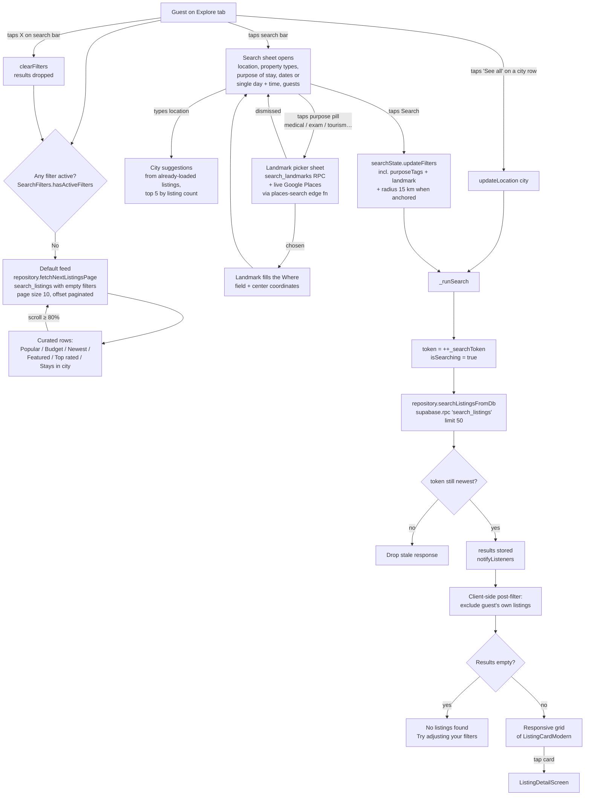
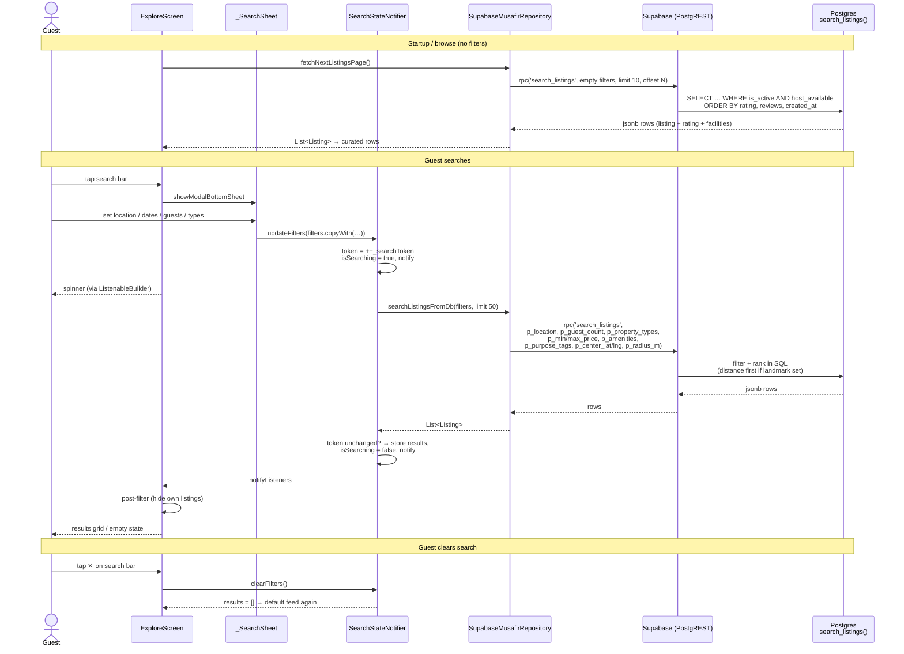

# Guest Listing Search — Explore Tab

How a guest finds listings in the Explore tab: the default browse feed, the
search sheet (location, dates, guests, property types, purpose), and the
server-side `search_listings` RPC that powers all of it.

## Key components

| Layer | File | Role |
|---|---|---|
| UI (screen) | `lib/screens/explore/explore_screen.dart` | Search bar, curated rows / results grid, infinite scroll |
| UI (sheet) | `_SearchSheet` in `explore_screen.dart` | Filter form: location, property types, purpose of stay (opens the landmark picker), dates/time, guests — ALL filters live here, the page has no chip rows |
| UI (picker) | `lib/widgets/landmark_picker_sheet.dart` | Landmark chooser for purpose search — curated `landmarks` rows plus live Google Places matches (`lib/services/places_service.dart` → `places-search` edge function), so any place findable on Google Maps can anchor the search |
| State | `lib/state/search_state.dart` (`SearchStateNotifier`) | Holds `SearchFilters` + results; debounces stale responses via a search token |
| Model | `lib/models/search_filters.dart` (`SearchFilters`) | Immutable filter set; `hasActiveFilters` decides feed vs search mode |
| Repository | `lib/repositories/supabase_musafir_repository.dart` → `searchListingsFromDb()` | Maps filters → RPC params, parses rows → `ListingSearchResult` |
| Geocoding | `lib/services/geocoding_service.dart` + `supabase/functions/geocode` | Typed place name → lat/lng (platform geocoder on mobile; Google Geocoding via edge function on web) |
| Database | `search_listings` RPC (migrations 082 + `085_search_listings_radius_tiers.sql`) | All filtering + ranking in SQL; PostGIS distance; expanding radius tiers |

Wiring: at startup `lib/app.dart` calls
`searchState.attachSearcher(repository.searchListingsFromDb)` — the state layer
never imports Supabase directly.

## Two modes: default feed vs active search

The screen is always in one of two modes, decided by
`SearchFilters.hasActiveFilters`:

1. **Browse (no filters)** — the repository paginates the *default feed*:
   `search_listings` called with empty filters, 10 rows per page, offset-based.
   Results render as Airbnb-style curated horizontal rows (Popular,
   Budget-friendly, Newly available, Featured, Top rated, Stays in {city}).
   Scrolling past 80% of the list loads the next page.
2. **Search (any filter active)** — `SearchStateNotifier` runs one server-side
   query (limit 50) and the screen switches to a responsive grid of the
   results. The feed paginator is bypassed (`_loadMoreListings` returns early),
   and an empty result shows the "No listings found" empty state instead of
   falling back to the feed.

Both modes go through the **same RPC** — the feed is just an unfiltered search,
so ranking is consistent everywhere.

## Flow chart

## Sequence diagram

## What the server filters and how it ranks

`search_listings` (SQL, `security invoker`, granted to `anon` +
`authenticated` — so it works before login) applies **all** of these in one
query over the full catalog:

- `is_active = true` and `host_available = true` — always enforced
- `p_property_types` — listing type in the selected set (room / seat / full house)
- `p_guest_count` — `max_guests >= count`
- `p_min_price` / `p_max_price` — against `least(hourly, daily, monthly)` rate
- `p_location` — case-insensitive substring match on **city OR address OR title**
- `p_amenities` — listing must have *every* selected amenity
- `p_purpose_tags` — array overlap with the listing's `purpose_tags` (migration 082)
- `p_center_lat/lng` + `p_radius_m` — PostGIS `ST_DWithin` around the chosen
  landmark (default radius 15 km)
- `p_center_lat/lng` + `p_radii` (migration 085) — **expanding proximity
  search**: returns the smallest tier (1 → 3 → 5 → 10 km) that contains any
  match; if none matches, falls back to the nearest stays regardless of
  distance (capped at 20). Rows carry `search_radius_m` + `radius_fallback`
  so the UI can label the result set.

Ranking (`ORDER BY`):
1. Distance to landmark, ascending (only when a landmark is set; listings
   without coordinates sort last)
2. Average rating, descending
3. Review count, descending
4. Newest first

Each row returns the listing plus its rating aggregate, review count,
facilities, and `distance_m` — so the client does no joins.

## Client-side behavior worth knowing

- **Stale-response guard** — every `_runSearch()` increments `_searchToken`;
  a response is discarded unless its token is still the newest. Rapid filter
  changes can't render out of order.
- **Post-filter in the UI** — after results arrive the client only *excludes
  the signed-in user's own listings* (and blocked hosts); property type and
  purpose are server-side filters set from the search sheet.
- **City suggestions are local** — the search sheet's location autocomplete is
  built from cities of listings already loaded in memory, not from a server
  query. Cities that only appear on unfetched feed pages won't be suggested.
- **Every filter change re-searches immediately** — each
  `updateX()` on `SearchStateNotifier` triggers `_runSearch()`; the sheet's
  Search button applies the whole form in one `updateFilters` call.
- **Errors fail soft** — the repository catches RPC errors and returns `[]`
  (logged via `debugPrint`); the state also stores `error`, but the screen
  currently renders the empty state rather than an error message.

## Landmark suggestions are restricted to the picked category

The landmark picker's live map suggestions come from the `places-search` edge
function, which takes the **landmark category** (`hospital`, `exam_center`,
`university`, `tourist_spot`, `business_hub`) — not a list of Google types.
The category → Google-place-type mapping lives in that function on purpose:
Android guests run whatever APK they last installed, so mapping fixes must not
need a client release.

Two lists per category, and they are deliberately different:

| | meaning | limits |
|---|---|---|
| `request` | what Google Autocomplete is *asked* to restrict to | ≤ 5 types from place-types Table 1/2 joined by `\|`, **or** exactly one Table 3 filter (`(regions)`, `establishment`) which cannot be mixed with anything — otherwise `INVALID_REQUEST` |
| `accept` | what a returned prediction must carry to be shown | no limit; may be wider than `request` |

Current mapping (verified against the live API for Bangladesh, Aug 2026):

| Category | request | notes |
|---|---|---|
| `hospital` | `hospital\|doctor` | `health` is deliberately excluded — it's a broad Table 2 umbrella that also covers pharmacies (a "FARMECY" leaked in under it) |
| `exam_center` | `school\|primary_school\|secondary_school\|university` + `library` | BD colleges are typed `university`, not `school` |
| `university` | `university` | |
| `tourist_spot` | `tourist_attraction\|museum\|park\|natural_feature\|zoo` | `natural_feature` is essential — Cox's Bazar Sea Beach is *only* that. `accept` additionally allows places of worship, since historic mosques/temples (Sixty Dome Mosque) are often typed only that way |
| `business_hub` | `(regions)` | business hubs here are **areas** (Motijheel, Gulshan, Karwan Bazar), not businesses, so this asks for localities/sublocalities rather than establishments |

**Two passes, because a narrow filter costs recall.** Google applies the
request-level type filter over a limited candidate set, so a narrow filter can
return nothing even when a matching place exists — `lalbagh` finds no
`tourist_attraction` although Lalbagh Kellah is one, and `karwan` finds no
region although Karwan Bazar is one. So: pass 1 asks for the category
(precision, and the only call for a typical query); if it yields nothing,
pass 2 re-asks unrestricted and keeps only predictions whose own types are in
`accept`. Recall returns without losing precision — `kfc` under Medical still
comes back empty.

Curated `landmarks` rows are matched separately by the `search_landmarks` RPC
and are *not* subject to any of this, which is what keeps un-taggable venues
reachable: British Council and IDP IELTS carry no educational Google type at
all, but they are seeded exam centers.

## Known limitations

1. **Dates/times are not filtered server-side.** `checkIn` / `checkOut` /
   `singleDate` + time range are collected in the sheet and count toward
   `hasActiveFilters`, but they are **not passed to the RPC** — a date-only
   search returns listings regardless of booking conflicts. Availability is
   checked later, on the listing detail screen via the `is_booking_available`
   RPC. (Booked-out listings therefore still appear in search results.)
2. **Search results are not paginated.** One query, `limit 50`. Beyond 50
   matches, the rest are unreachable until filters narrow.
3. **Price filter compares against the cheapest rate** (`least` of
   hourly/daily/monthly), which can surprise when a guest thinks in
   nightly prices but a listing has a low hourly rate.

## Proximity search (added with migration 085)

When the guest types a place ("dakshinkhan") or taps **Use my current
location** in the search sheet:

1. If the text is not a known listing city, it's geocoded to coordinates —
   platform geocoder on mobile, `geocode` edge function (Google Geocoding,
   Bangladesh-biased, server-side key) on web and as mobile fallback. A city
   name that we already have listings for keeps the classic text search (all
   stays in that city). If geocoding fails, the classic `ilike` text search
   still runs, so nothing regresses.
2. The RPC searches expanding rings around the point: 1 km, then 3 km, 5 km,
   10 km — first ring with a match wins, distance-sorted. Nothing within
   10 km → nearest stays returned instead, flagged as fallback.
3. Explore shows a banner ("3 stays within 5 km of Dakshinkhan" / "No stays
   close to X — showing the nearest ones instead") and cards show distance.

Caveats: listings without a map pin are invisible to proximity search, and
listings pinned at the old default coordinates (Mohakhali) rank wrongly —
they need re-pinning via Edit listing.
