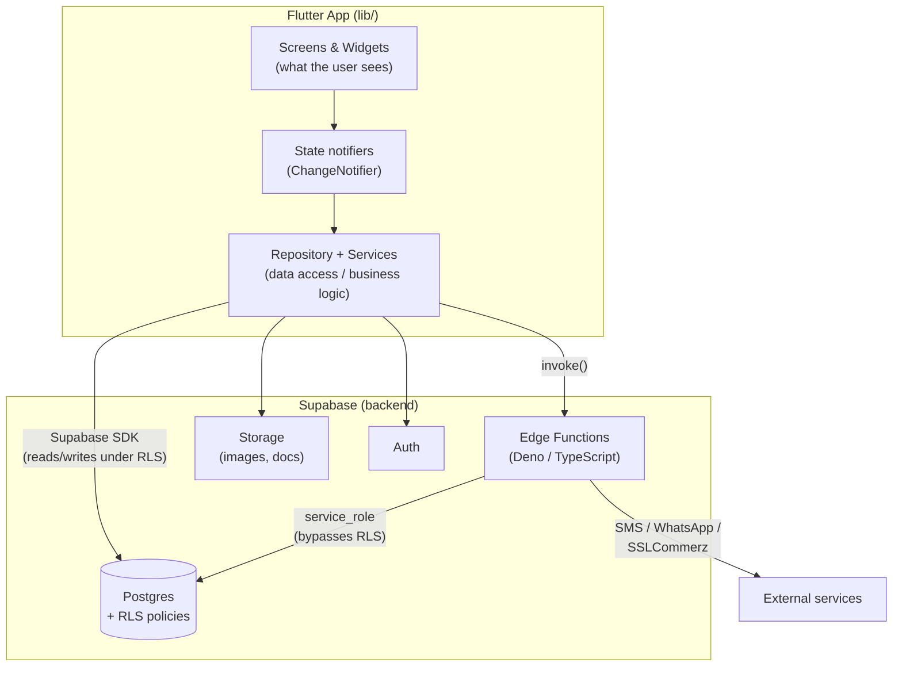
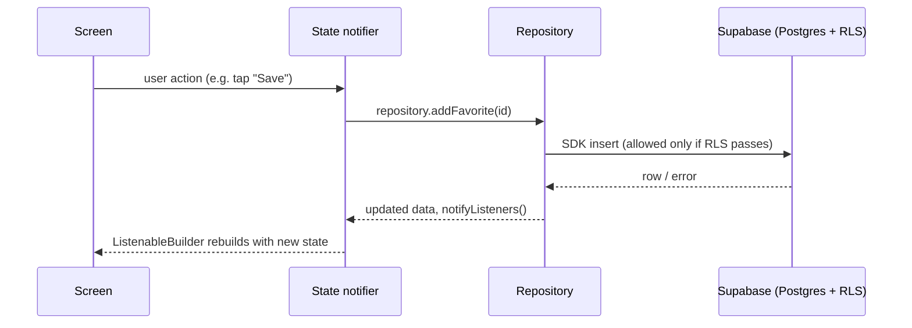
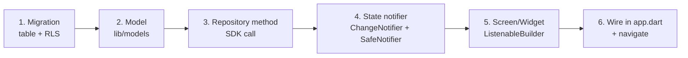

# Musaafir — New Developer Onboarding Guide

Welcome to Musaafir 👋 — a rental marketplace (tenants, house owners/hosts, and
admins) built as a **Flutter** app (Android, iOS, and Web from one codebase)
backed by **Supabase** (Postgres + Auth + Storage + Edge Functions).

This guide is written for someone opening the repo for the **first time**. It
tells you *how to read the code*, *how the pieces fit*, and gives you
**copy-paste recipes** for the things you'll do most: add a screen, add a
feature, add a data field, add a backend function.

> **Read these too — this guide complements them, it does not replace them:**
> - [README.md](../README.md) — install, run, configuration, OTP/auth setup, master-OTP warning.
> - [architecture.md](architecture.md) — deep architecture, core user flows (auth, booking, host onboarding) as sequence diagrams.
> - [backend_schema.md](backend_schema.md) / [live_schema.sql](live_schema.sql) — the database tables.
> - [WEB_DEPLOYMENT.md](WEB_DEPLOYMENT.md) — building and deploying the web app.

---

## 1. The 30-minute mental model

Musaafir has **two halves**: the Flutter client (the "frontend/UI") and the
Supabase project (the "backend"). The client never talks to a custom server of
ours — it talks **directly to Supabase** using the Supabase Dart SDK, and
Postgres **Row-Level Security (RLS)** is what keeps one user from reading
another's data. Logic that must be trusted (sending OTP SMS, taking payments,
sending templated messages) lives in **Edge Functions** so secrets stay
server-side.



**The golden rule of data flow inside the app is one direction:**

```
Screen (UI)  →  State notifier  →  Repository / Service  →  Supabase
     ▲                                                          │
     └──────────  ListenableBuilder rebuilds on change  ◀───────┘
```

A screen never calls Supabase directly. It reads/writes through a **state
notifier** or a **repository**. When data changes, the notifier calls
`notifyListeners()` and any `ListenableBuilder` wrapping the UI rebuilds. That's
the whole loop — learn this and the rest is detail.

---

## 2. Getting the project running

```bash
# 1. Install dependencies
flutter pub get

# 2. Run on a device / simulator / Chrome
flutter run                 # pick a device when prompted
flutter run -d chrome       # web

# 3. Sanity checks you should run before every commit
flutter analyze             # static analysis — must say "No issues found!"
flutter test                # unit/widget tests
```

Supabase URL + anon key are already wired in
[lib/config/supabase_config.dart](../lib/config/supabase_config.dart) (the anon
key is public-by-design and safe to commit). See [README.md](../README.md#configuration)
for Google Maps keys, OTP/SMS setup, and the **master-OTP** QA warning — read
that warning before you touch auth.

> A `.githooks/` pre-commit hook and `analysis_options.yaml` enforce lint
> rules. If a commit is rejected, run `flutter analyze` and fix what it prints.

---

## 3. Codebase structure

### 3.1 Top-level layout

```
musafirr/
├── lib/                 ← the Flutter app (all Dart code) — YOU LIVE HERE
├── supabase/
│   ├── migrations/      ← database schema, one numbered .sql file per change
│   └── functions/       ← Edge Functions (Deno/TypeScript) — the trusted backend
├── web/                 ← web entry point (index.html, splash, service worker)
├── android/ ios/        ← native platform projects (rarely edited by app devs)
├── landing/             ← static marketing landing page (plain HTML, not Flutter)
├── docs/                ← you are here
├── test/                ← unit & widget tests
├── tool/                ← build scripts (e.g. build_web.sh)
└── pubspec.yaml         ← dependencies & Flutter config
```

### 3.2 Inside `lib/` — the layers

This is the most important tree to internalize. Each folder is a **layer**, and
they depend **downward only** (screens depend on state/services, never the
reverse):

```
lib/
├── main.dart            ← app entry: init Firebase, Supabase, then runApp()
├── app.dart            ← MusafirApp: builds all state notifiers, wires them,
│                          chooses splash / login / MainShell based on auth
│
├── config/              ← environment & 3rd-party config (Supabase, Firebase,
│                          Maps, OTP, SMS, WhatsApp, Messenger). Constants only.
│
├── models/              ← plain Dart data classes (Listing, Booking, User,
│                          Review, Discount…). No UI, no I/O. fromJson/toJson.
│
├── repositories/        ← data access. MusafirRepository (abstract interface)
│                          + SupabaseMusafirRepository (the real Supabase impl).
│                          This is the app's main gateway to the database.
│
├── services/            ← focused business logic, grouped by domain:
│   ├── auth/            ← sign-in, session, AuthService + factory
│   ├── booking/        ← booking lifecycle rules & coordination
│   ├── messaging/      ← conversations, templated messages
│   ├── notifications/  ← push (Firebase mobile / web) + in-app
│   ├── payment/        ← SSLCommerz / cash
│   ├── discount/ review/ sms/ verification/  …
│   └── image_upload_service.dart, location_service.dart, …
│
├── state/               ← ChangeNotifier state notifiers, one per concern
│                          (auth, search, favorites, messaging, notifications,
│                          host, loyalty, referral, discount, app_mode…).
│                          These are the "view models" the UI listens to.
│
├── core/                ← cross-cutting building blocks:
│   ├── theme/          ← AppColors, AppTypography, AppTheme (the design system)
│   ├── utils/          ← responsive.dart, result.dart, image_utils.dart…
│   ├── currency/       ← money & price formatting (BDT ৳)
│   ├── discount/       ← the discount/stacking engine
│   └── state/          ← SafeNotifier mixin (build-safe notifyListeners)
│
├── screens/             ← the UI, one folder per feature area (see below)
└── widgets/             ← reusable widgets shared across screens
    ├── common/ dialogs/ animations/ messaging/ discount/
    └── listing_card_modern.dart, modern_banner.dart, …
```

### 3.3 `screens/` — organized by feature

```
screens/
├── main_shell.dart          ← the app frame: bottom nav + role switching
├── splash/                  ← startup splash while auth resolves
├── auth/                    ← phone entry → OTP → profile completion
├── explore/                 ← search, map, listing detail  (guest home)
├── wishlists/               ← saved listings
├── trips/                   ← guest bookings
├── messaging/ inbox/        ← chat
├── notifications/           ← notification center + settings
├── host/ hosting/           ← host dashboard, create/edit listing, reservations
├── review/                  ← guest & host reviews
├── verification/            ← identity / address-proof verification
├── discount/                ← loyalty & referral
├── leaderboard/             ← host leaderboard
├── profile/                 ← profile & account
├── payment/                 ← payment result
└── admin_dashboard.dart …   ← admin views
```

> **Two apps in one.** Musaafir has a **guest mode** and a **host mode** for the
> same logged-in user. [main_shell.dart](../lib/screens/main_shell.dart) swaps
> the bottom navigation and the set of screens based on `AppMode` (see
> `state/app_mode_state.dart`). When you add a screen, know which mode it
> belongs to.

---

## 4. How the layers actually connect

### 4.1 State management: `ChangeNotifier`, wired manually in `app.dart`

We use plain Flutter `ChangeNotifier` state notifiers — **not** Riverpod/BLoC,
and only lightly the `provider` package. All the app-wide notifiers are
**instantiated once** in [app.dart](../lib/app.dart)'s `MusafirApp` and passed
**down through constructors** to `MainShell` and then to screens.

Every notifier mixes in **`SafeNotifier`**
([core/state/safe_notifier.dart](../lib/core/state/safe_notifier.dart)), which
makes `notifyListeners()` safe to call during a build and after dispose — so you
never see *"setState() called during build"*. Always use it:

```dart
class MyFeatureState extends ChangeNotifier with SafeNotifier {
  bool _loading = false;
  bool get loading => _loading;

  Future<void> load() async {
    _loading = true;
    notifyListeners();            // safe, even if called from initState
    // ... fetch via a repository/service ...
    _loading = false;
    notifyListeners();
  }
}
```

Screens **listen** with `ListenableBuilder` and rebuild when the notifier fires:

```dart
ListenableBuilder(
  listenable: Listenable.merge([repository, favoritesState]), // one or many
  builder: (context, _) {
    final items = repository.listings;
    return ListView(children: [ /* build from items */ ]);
  },
)
```

This exact pattern is used across the app — a clean small example to read first
is [wishlists_screen.dart](../lib/screens/wishlists/wishlists_screen.dart).

### 4.2 Repository: the app's door to the database

[repositories/musafir_repository.dart](../lib/repositories/musafir_repository.dart)
is an **abstract interface**;
[supabase_musafir_repository.dart](../lib/repositories/supabase_musafir_repository.dart)
is the implementation that calls Supabase. Screens depend on the **interface**,
which makes the code testable and keeps Supabase details in one place.



### 4.3 Navigation

We use **imperative navigation** — `Navigator.push` with `MaterialPageRoute` —
**not** named routes. To open a screen:

```dart
Navigator.of(context).push(
  MaterialPageRoute(builder: (_) => ListingDetailScreen(listing: listing)),
);
```

The **top-level** flow (splash → login → main app) is decided in
[app.dart](../lib/app.dart) by `authState.status`
(`initializing` / `authenticated` / `unauthenticated`). The login sub-flow
(phone → OTP → profile) is a small state machine in `AuthNavigator` in the same
file. You rarely touch these; you mostly `push` feature screens onto the stack.

### 4.4 The design system (use it — don't hardcode)

- **Colors:** [core/theme/app_colors.dart](../lib/core/theme/app_colors.dart).
  Brand teal is `AppColors.brand` (`#0B7285`). Use `AppColors.*`, never raw
  `Color(0x…)` in screens.
- **Type:** [core/theme/app_typography.dart](../lib/core/theme/app_typography.dart)
  and `Theme.of(context).textTheme`.
- **Theme:** the app is **light-only on purpose** (`themeMode: ThemeMode.light`
  in app.dart) — don't add dark-mode-only styling to screens.
- **Responsive:** wrap scrollable page bodies in **`ResponsiveCenter`**
  ([core/utils/responsive.dart](../lib/core/utils/responsive.dart)) so content
  is centered with side margins on web/desktop and unchanged on phones. Every
  page should do this — it's the fix for "content stretches edge-to-edge on the
  web".
- **Money:** format with the currency helpers in
  [core/currency/](../lib/core/currency/), never `"৳$amount"` by hand.

---

## 5. The backend (`supabase/`)

### 5.1 Migrations — every schema change is a numbered file

```
supabase/migrations/
├── 001_*.sql
├── ...
├── 082_listing_purpose_and_landmarks.sql
├── 083_avatars_allow_webp.sql
└── 084_documents_allow_webp.sql   ← add the NEXT number for your change
```

Rules:
- **Never** edit an old migration that's already applied. Add a **new** file
  with the next number (`085_...`).
- Every table needs **RLS policies** — this *is* the security model. A table
  with RLS enabled and no policy is invisible to clients; a table without RLS is
  wide open. When you add a table, add its policies in the same migration.
- The live database can drift from these files — see the team note on querying
  the live DB before assuming a column exists.

### 5.2 Edge Functions — trusted server-side logic (Deno/TypeScript)

```
supabase/functions/
├── _shared/            ← shared helpers (e.g. otp.ts, CORS)
├── send-otp/           ← generate + hash + SMS an OTP (token stays server-side)
├── verify-otp/         ← verify the code, sign the user in
├── send-push-notification/
├── sslcommerz-init/ sslcommerz-ipn/   ← payments
├── whatsapp-webhook/ messenger-webhook/
├── validate-discount/ google-directions/ …
```

Use an Edge Function whenever logic must be **trusted** (holds a secret, must
not be tampered with, or needs to bypass RLS via the `service_role` key).
Everything else should be a direct SDK call from the app under RLS.

Deploy / secrets (see each function's header comment):

```bash
supabase functions deploy <name> --project-ref <ref>
supabase secrets set KEY="value" --project-ref <ref>
```

---

## 6. Recipes — how to actually do the common tasks

### 6.1 Add a new page/screen

1. **Create the file** under the right feature folder, e.g.
   `lib/screens/host/payout_settings_screen.dart`. Match the folder to the
   feature and to guest-vs-host mode.
2. **Write a `StatelessWidget`/`StatefulWidget`.** Take the state/repository it
   needs as constructor parameters (that's how the app injects dependencies).
   Do **not** add a `Scaffold` if `MainShell` already provides the AppBar for
   that tab — follow a neighboring screen.
3. **Wrap the body in `ResponsiveCenter`** so it looks right on web.
4. **Listen to state** with `ListenableBuilder` if it shows live data.
5. **Navigate to it** from wherever the entry point is:
   ```dart
   Navigator.of(context).push(
     MaterialPageRoute(builder: (_) => PayoutSettingsScreen(hostState: hostState)),
   );
   ```
6. `flutter analyze` → fix warnings → run it.

Skeleton:

```dart
import 'package:flutter/material.dart';
import '../../core/utils/responsive.dart';

class PayoutSettingsScreen extends StatelessWidget {
  const PayoutSettingsScreen({super.key});

  @override
  Widget build(BuildContext context) {
    return Scaffold(                          // include Scaffold if pushed as a full page
      appBar: AppBar(title: const Text('Payout settings')),
      body: ResponsiveCenter(
        child: SingleChildScrollView(
          padding: const EdgeInsets.all(16),
          child: Column(
            crossAxisAlignment: CrossAxisAlignment.start,
            children: const [
              // ... your UI ...
            ],
          ),
        ),
      ),
    );
  }
}
```

### 6.2 Add a new feature end-to-end

Work **bottom-up**, one layer at a time:



1. **Data (if needed):** new migration `085_*.sql` with the table + RLS
   policies, or an Edge Function if it needs a secret.
2. **Model:** a plain class in `lib/models/` with `fromJson`/`toJson`.
3. **Repository:** add the method to the `MusafirRepository` interface and
   implement it in `SupabaseMusafirRepository` (this is where the SDK call
   lives).
4. **State:** a `ChangeNotifier with SafeNotifier` that calls the repository and
   exposes read-only getters + `load()`/mutation methods.
5. **UI:** the screen/widgets that render it via `ListenableBuilder`.
6. **Wire it:** if it's app-wide state, construct it in
   [app.dart](../lib/app.dart) and pass it down through `MainShell`; otherwise
   create it locally in the screen.

### 6.3 Add a field to existing data (e.g. `Listing.floorNumber`)

1. Migration `085_add_floor_number_to_listings.sql`:
   `alter table listings add column floor_number int;`
2. Add `floorNumber` to the `Listing` model + its `fromJson`/`toJson`.
3. If it's shown/edited, update the relevant screen(s) (e.g. create/edit
   listing) and any repository mapping.
4. `flutter analyze` and test the create/edit/display paths.

### 6.4 Add an Edge Function

1. `mkdir supabase/functions/my-func` and add `index.ts` (copy the header-comment
   style from `send-otp/index.ts`; reuse `_shared/` helpers).
2. `supabase functions deploy my-func --project-ref <ref>` and set any secrets.
3. Call it from a repository/service with
   `Supabase.instance.client.functions.invoke('my-func', body: {...})`.

---

## 7. Conventions & house rules

- **Match the neighbors.** Before writing anything, open 2–3 files in the same
  folder and copy their structure, naming, and comment density.
- **No raw colors / fonts / currency in screens** — use `AppColors`,
  `textTheme`, and the currency helpers.
- **All notifiers use `SafeNotifier`.** Never call `notifyListeners()` from a
  class that doesn't mix it in.
- **Screens don't call Supabase directly** — go through a repository or service.
- **`flutter analyze` must be clean** before you commit; the repo lints on
  commit.
- **Migrations are append-only and numbered**; every new table gets RLS.
- **Secrets never go in the app** (it ships to users) — they live in Edge
  Function secrets. The Supabase *anon* key in `config/` is the exception; it's
  public by design.
- **Git:** branch off `main`, keep commits focused, open a PR. Don't commit or
  push unless asked.

---

## 8. A suggested first-week reading path

1. [app.dart](../lib/app.dart) — see every state notifier get created and wired.
2. [main_shell.dart](../lib/screens/main_shell.dart) — see guest vs host mode and
   the bottom nav.
3. [wishlists_screen.dart](../lib/screens/wishlists/wishlists_screen.dart) — a
   clean, small `ListenableBuilder` screen.
4. [musafir_repository.dart](../lib/repositories/musafir_repository.dart) — the
   full list of data operations the app can do.
5. [models/listing.dart](../lib/models/listing.dart) and
   [models/booking.dart](../lib/models/booking.dart) — the two core entities.
6. [core/theme/app_colors.dart](../lib/core/theme/app_colors.dart) &
   [core/utils/responsive.dart](../lib/core/utils/responsive.dart) — the design
   system you must reuse.
7. `supabase/functions/send-otp/index.ts` — what a real backend function looks
   like.
8. Then skim [architecture.md](architecture.md) for the full user-flow sequence
   diagrams.

**Your first task idea:** find a small screen, add a harmless field or a bit of
copy, run it on web (`flutter run -d chrome`), and open a PR. Doing the full
loop once — edit → analyze → run → PR — teaches more than reading ever will.

Welcome aboard. When in doubt, read a neighboring file and match it.
