# Musafir Architecture

> A Flutter-based rental marketplace for spaces (seats, rooms, houses) with guest and host capabilities.

## Table of Contents

- [System Overview](#system-overview)
- [Tech Stack](#tech-stack)
- [Architecture Pattern](#architecture-pattern)
- [Project Structure](#project-structure)
- [Core Flows](#core-flows)
  - [Authentication Flow](#authentication-flow)
  - [Phone Registration Flow](#phone-registration-flow)
  - [Search to Reservation Flow](#search-to-reservation-flow)
  - [Host Onboarding Flow](#host-onboarding-flow)
  - [Booking Management Flow](#booking-management-flow)
- [Data Layer](#data-layer)
- [State Management](#state-management)
- [Key Components](#key-components)

---

## System Overview

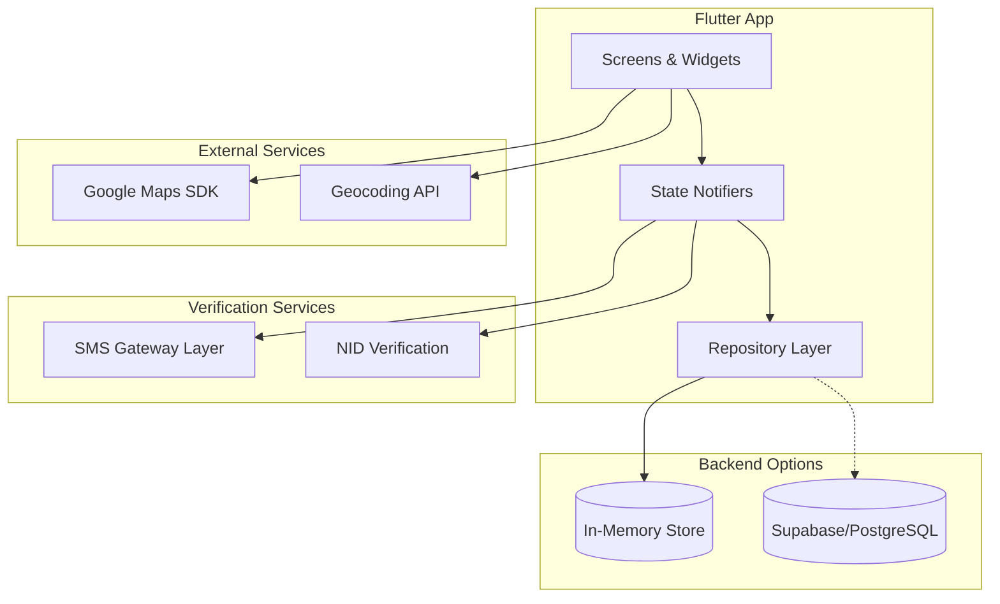
```mermaid
graph TB
    subgraph Client["Flutter App"]
        UI[Screens & Widgets]
        State[State Notifiers]
        Repo[Repository Layer]
    end

    subgraph Backend["Backend Options"]
        InMem[(In-Memory Store)]
        Supa[(Supabase/PostgreSQL)]
    end

    subgraph Services["External Services"]
        Maps[Google Maps SDK]
        Geo[Geocoding API]
    end

    subgraph Verification["Verification Services"]
        SMS[SMS Gateway Layer]
        NID[NID Verification]
    end

    UI --> State
    State --> Repo
    Repo --> InMem
    Repo -.-> Supa
    UI --> Maps
    UI --> Geo
    State --> SMS
    State --> NID
```

**Key Characteristics:**
- Two-sided marketplace (Guests & Hosts)
- In-memory data layer with Supabase-ready architecture
- ChangeNotifier-based reactive state management
- Material 3 design system
- Phone-based registration with OTP verification
- NID (National ID) verification for user trust

---

## Tech Stack

| Layer | Technology |
|-------|------------|
| Framework | Flutter 3.x |
| State | ChangeNotifier |
| Backend | Supabase (prepared) / In-Memory (current) |
| Maps | Google Maps Flutter |
| Location | Geolocator + Geocoding |
| HTTP | http ^1.2.0 |
| Design | Material 3 |

---

## Architecture Pattern

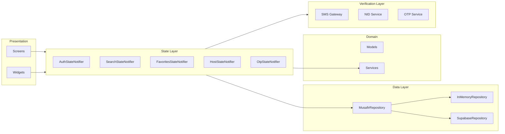
```mermaid
graph LR
    subgraph Presentation
        Screens
        Widgets
    end

    subgraph State["State Layer"]
        Auth[AuthStateNotifier]
        Search[SearchStateNotifier]
        Fav[FavoritesStateNotifier]
        Host[HostStateNotifier]
        Otp[OtpStateNotifier]
    end

    subgraph Data["Data Layer"]
        RepoInterface[MusafirRepository]
        InMemRepo[InMemoryRepository]
        SupaRepo[SupabaseRepository]
    end

    subgraph Domain
        Models
        Services
    end

    subgraph Verification["Verification Layer"]
        SmsGateway[SMS Gateway]
        NidService[NID Service]
        OtpService[OTP Service]
    end

    Screens --> State
    Widgets --> State
    State --> RepoInterface
    RepoInterface --> InMemRepo
    RepoInterface --> SupaRepo
    State --> Services
    State --> Verification
```

**Pattern:** Feature-first modular architecture with repository abstraction

**Data Flow:** Unidirectional
```
User Action → State Notifier → Repository → Data Store → Notify Listeners → UI Rebuild
```

---

## Project Structure

```
lib/
├── main.dart                 # Entry point
├── app.dart                  # App root & dependency setup
├── config/                   # Environment configuration
│   ├── supabase_config.dart  # Supabase credentials
│   └── sms_config.dart       # SMS provider configuration
├── models/                   # Domain entities
│   ├── user.dart             # User with NID & verification fields
│   ├── listing.dart
│   ├── booking.dart
│   └── review.dart
├── repositories/             # Data access layer
│   ├── musafir_repository.dart        # Interface
│   ├── in_memory_musafir_repository.dart
│   └── supabase_musafir_repository.dart
├── state/                    # State management
│   ├── auth_state.dart       # Auth with phone signup support
│   ├── otp_state.dart        # OTP flow state management
│   ├── search_state.dart
│   ├── favorites_state.dart
│   └── host_state.dart
├── services/                 # Platform services
│   ├── location_service.dart
│   ├── otp_service.dart      # OTP generation & verification
│   ├── sms/                  # SMS gateway layer
│   │   ├── sms_gateway.dart           # Interface
│   │   ├── sms_send_result.dart       # Result model
│   │   ├── sms_gateway_factory.dart   # Gateway factory
│   │   ├── console_sms_gateway.dart   # Dev implementation
│   │   ├── bulk_sms_bd_gateway.dart   # BulkSMS BD
│   │   ├── alpha_sms_gateway.dart     # Alpha SMS
│   │   └── zaman_it_sms_gateway.dart  # Zaman IT SMS
│   └── nid/                  # NID verification layer
│       ├── nid_verification_service.dart  # Interface
│       └── bypass_nid_verification.dart   # Dev bypass
├── screens/                  # Feature screens
│   ├── auth/
│   │   ├── login_screen.dart
│   │   ├── signup_screen.dart
│   │   ├── phone_entry_screen.dart        # Phone registration
│   │   ├── otp_verification_screen.dart   # OTP entry
│   │   └── profile_completion_screen.dart # NID verification
│   ├── explore/
│   ├── host/
│   ├── trips/
│   ├── wishlists/
│   ├── inbox/
│   └── profile/
├── widgets/                  # Reusable components
│   ├── app_text_field.dart
│   ├── phone_input_field.dart    # BD phone input with +880
│   ├── otp_input_field.dart      # 4-digit OTP boxes
│   └── nid_input_field.dart      # NID validation (10/17 digits)
└── data/                     # Mock data & catalogs
```

---

## Core Flows

### Authentication Flow

The app supports two authentication methods:
1. **Email-based signup** - Traditional email/password registration
2. **Phone-based signup** - OTP verification with NID for identity

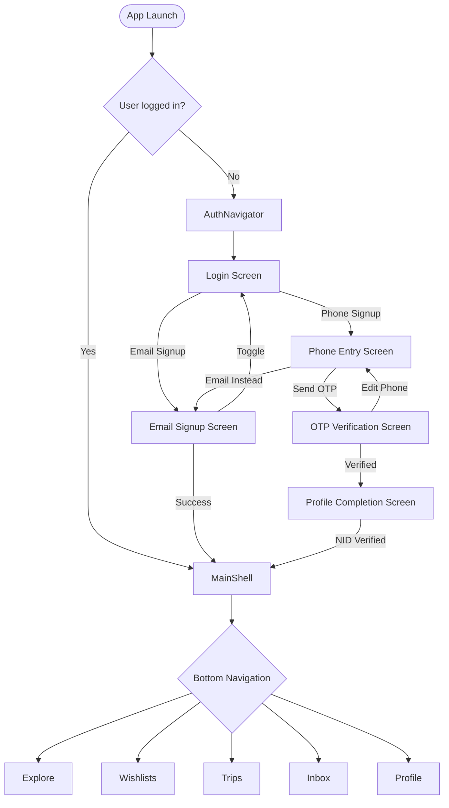
```mermaid
flowchart TD
    Start([App Launch]) --> CheckAuth{User logged in?}
    CheckAuth -->|No| AuthNav[AuthNavigator]
    CheckAuth -->|Yes| MainShell[MainShell]

    AuthNav --> LoginScreen[Login Screen]

    LoginScreen -->|Email Signup| SignupScreen[Email Signup Screen]
    LoginScreen -->|Phone Signup| PhoneEntry[Phone Entry Screen]

    SignupScreen -->|Toggle| LoginScreen
    PhoneEntry -->|Email Instead| SignupScreen

    SignupScreen -->|Success| MainShell

    PhoneEntry -->|Send OTP| OtpScreen[OTP Verification Screen]
    OtpScreen -->|Edit Phone| PhoneEntry
    OtpScreen -->|Verified| ProfileScreen[Profile Completion Screen]
    ProfileScreen -->|NID Verified| MainShell

    MainShell --> Tabs{Bottom Navigation}
    Tabs --> Explore[Explore]
    Tabs --> Wishlists[Wishlists]
    Tabs --> Trips[Trips]
    Tabs --> Inbox[Inbox]
    Tabs --> Profile[Profile]
```

**Email Authentication Flow:**

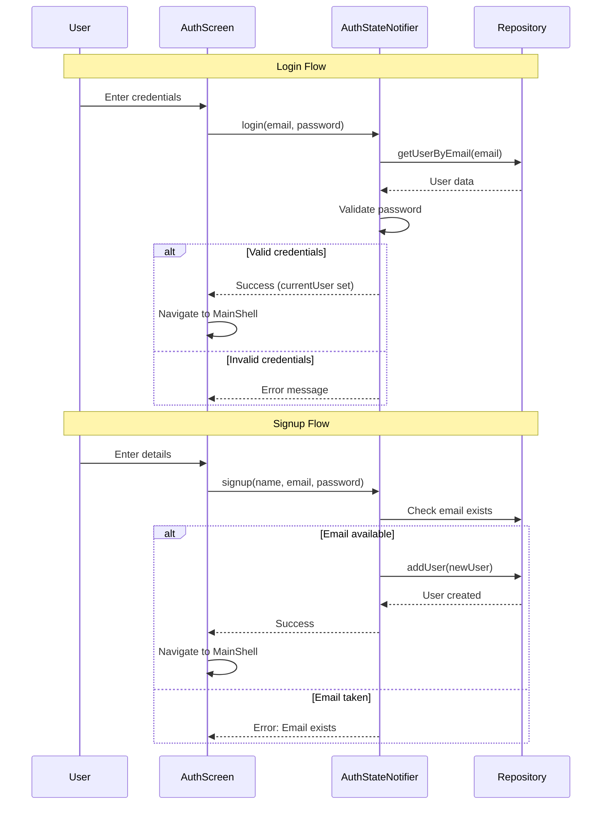
```mermaid
sequenceDiagram
    participant U as User
    participant UI as AuthScreen
    participant AS as AuthStateNotifier
    participant R as Repository

    Note over U,R: Login Flow
    U->>UI: Enter credentials
    UI->>AS: login(email, password)
    AS->>R: getUserByEmail(email)
    R-->>AS: User data
    AS->>AS: Validate password
    alt Valid credentials
        AS-->>UI: Success (currentUser set)
        UI->>UI: Navigate to MainShell
    else Invalid credentials
        AS-->>UI: Error message
    end

    Note over U,R: Signup Flow
    U->>UI: Enter details
    UI->>AS: signup(name, email, password)
    AS->>R: Check email exists
    alt Email available
        AS->>R: addUser(newUser)
        R-->>AS: User created
        AS-->>UI: Success
        UI->>UI: Navigate to MainShell
    else Email taken
        AS-->>UI: Error: Email exists
    end
```

**Key Files:**
- `lib/screens/auth/login_screen.dart`
- `lib/screens/auth/signup_screen.dart`
- `lib/state/auth_state.dart`

**User Roles:**
| Role | Access |
|------|--------|
| `tenant` | Browse, book, manage trips |
| `owner` | All tenant + host dashboard |
| `admin` | Full system access |

---

### Phone Registration Flow

Phone-based registration with OTP verification and NID identity verification.

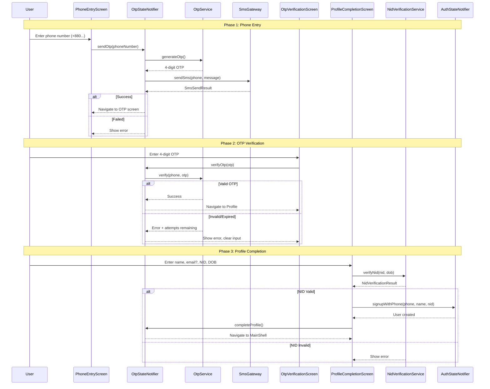
```mermaid
sequenceDiagram
    participant U as User
    participant PE as PhoneEntryScreen
    participant OS as OtpStateNotifier
    participant OTP as OtpService
    participant SMS as SmsGateway
    participant OV as OtpVerificationScreen
    participant PC as ProfileCompletionScreen
    participant NID as NidVerificationService
    participant AS as AuthStateNotifier

    Note over U,AS: Phase 1: Phone Entry
    U->>PE: Enter phone number (+880...)
    PE->>OS: sendOtp(phoneNumber)
    OS->>OTP: generateOtp()
    OTP-->>OS: 4-digit OTP
    OS->>SMS: sendSms(phone, message)
    SMS-->>OS: SmsSendResult
    alt Success
        OS-->>PE: Navigate to OTP screen
    else Failed
        OS-->>PE: Show error
    end

    Note over U,AS: Phase 2: OTP Verification
    U->>OV: Enter 4-digit OTP
    OV->>OS: verifyOtp(otp)
    OS->>OTP: verify(phone, otp)
    alt Valid OTP
        OTP-->>OS: Success
        OS-->>OV: Navigate to Profile
    else Invalid/Expired
        OTP-->>OS: Error + attempts remaining
        OS-->>OV: Show error, clear input
    end

    Note over U,AS: Phase 3: Profile Completion
    U->>PC: Enter name, email?, NID, DOB
    PC->>NID: verifyNid(nid, dob)
    NID-->>PC: NidVerificationResult
    alt NID Valid
        PC->>AS: signupWithPhone(phone, name, nid)
        AS-->>PC: User created
        PC->>OS: completeProfile()
        OS-->>PC: Navigate to MainShell
    else NID Invalid
        NID-->>PC: Show error
    end
```

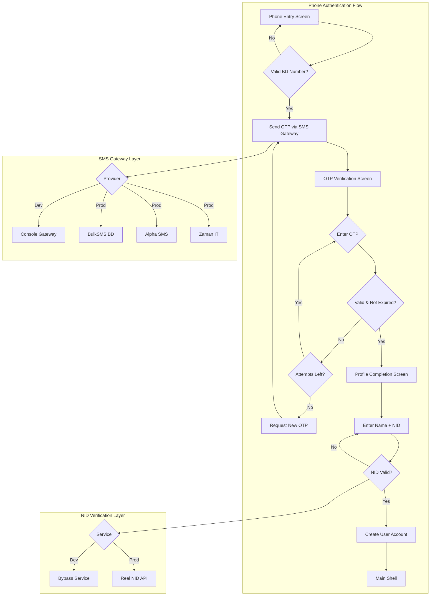
```mermaid
flowchart TD
    subgraph PhoneAuth["Phone Authentication Flow"]
        A[Phone Entry Screen] --> B{Valid BD Number?}
        B -->|No| A
        B -->|Yes| C[Send OTP via SMS Gateway]
        C --> D[OTP Verification Screen]

        D --> E{Enter OTP}
        E --> F{Valid & Not Expired?}
        F -->|No| G{Attempts Left?}
        G -->|Yes| E
        G -->|No| H[Request New OTP]
        H --> C

        F -->|Yes| I[Profile Completion Screen]

        I --> J[Enter Name + NID]
        J --> K{NID Valid?}
        K -->|No| J
        K -->|Yes| L[Create User Account]
        L --> M[Main Shell]
    end

    subgraph SMS["SMS Gateway Layer"]
        C --> SMS1{Provider}
        SMS1 -->|Dev| Console[Console Gateway]
        SMS1 -->|Prod| BulkSMS[BulkSMS BD]
        SMS1 -->|Prod| Alpha[Alpha SMS]
        SMS1 -->|Prod| Zaman[Zaman IT]
    end

    subgraph NIDVerify["NID Verification Layer"]
        K --> NID1{Service}
        NID1 -->|Dev| Bypass[Bypass Service]
        NID1 -->|Prod| RealNID[Real NID API]
    end
```

**SMS Gateway Architecture:**

```
┌─────────────────────────────────────────────────────────────────┐
│                        SMS Gateway Layer                         │
├─────────────────────────────────────────────────────────────────┤
│  SmsGateway (Interface)                                         │
│    ├── ConsoleSmsGateway (Dev - prints OTP to console)         │
│    ├── BulkSmsBdGateway                                         │
│    ├── AlphaSmsGateway                                          │
│    └── ZamanItSmsGateway                                        │
└─────────────────────────────────────────────────────────────────┘

┌─────────────────────────────────────────────────────────────────┐
│                     NID Verification Layer                       │
├─────────────────────────────────────────────────────────────────┤
│  NidVerificationService (Interface)                             │
│    └── BypassNidVerificationService (Dev - returns true)        │
└─────────────────────────────────────────────────────────────────┘
```

**OTP Configuration:**
| Setting | Value |
|---------|-------|
| OTP Length | 4 digits |
| Validity | 5 minutes |
| Max Attempts | 3 |
| Resend Cooldown | 60 seconds |

**Validation Rules:**
| Field | Rule |
|-------|------|
| Phone (BD) | 11 digits starting with 01, or 13 digits starting with 8801 |
| OTP | 4 digits |
| NID (BD) | 10 digits (old) or 17 digits (new) |

**Development Mode:**
| Component | Dev Behavior |
|-----------|--------------|
| SMS Gateway | Prints OTP to console, no actual SMS |
| OTP Code | 4-digit, printed in console |
| NID Verification | Always returns true, logs to console |

**Key Files:**
- `lib/screens/auth/phone_entry_screen.dart`
- `lib/screens/auth/otp_verification_screen.dart`
- `lib/screens/auth/profile_completion_screen.dart`
- `lib/state/otp_state.dart`
- `lib/services/otp_service.dart`
- `lib/services/sms/sms_gateway.dart`
- `lib/services/nid/nid_verification_service.dart`

---

### Search to Reservation Flow

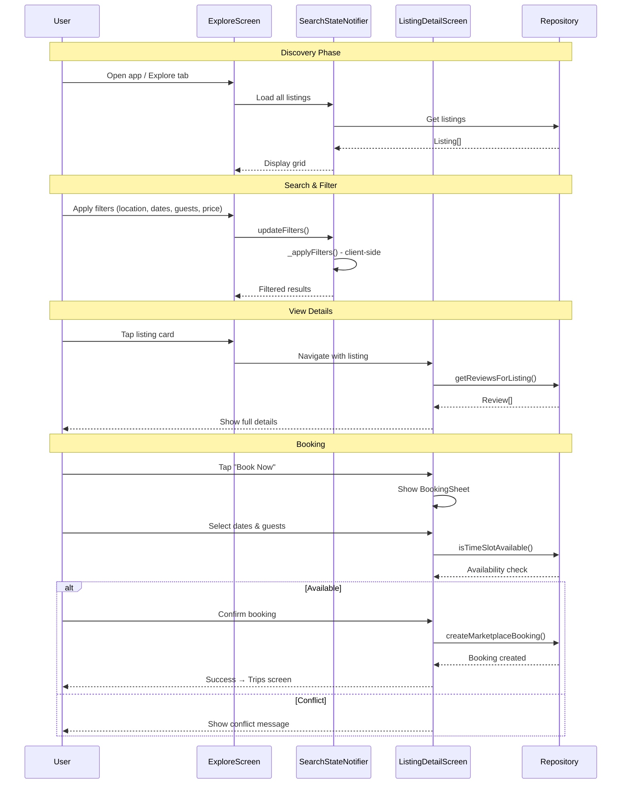
```mermaid
sequenceDiagram
    participant U as User
    participant ES as ExploreScreen
    participant SS as SearchStateNotifier
    participant LD as ListingDetailScreen
    participant R as Repository

    Note over U,R: Discovery Phase
    U->>ES: Open app / Explore tab
    ES->>SS: Load all listings
    SS->>R: Get listings
    R-->>SS: Listing[]
    SS-->>ES: Display grid

    Note over U,R: Search & Filter
    U->>ES: Apply filters (location, dates, guests, price)
    ES->>SS: updateFilters()
    SS->>SS: _applyFilters() - client-side
    SS-->>ES: Filtered results

    Note over U,R: View Details
    U->>ES: Tap listing card
    ES->>LD: Navigate with listing
    LD->>R: getReviewsForListing()
    R-->>LD: Review[]
    LD-->>U: Show full details

    Note over U,R: Booking
    U->>LD: Tap "Book Now"
    LD->>LD: Show BookingSheet
    U->>LD: Select dates & guests
    LD->>R: isTimeSlotAvailable()
    R-->>LD: Availability check
    alt Available
        U->>LD: Confirm booking
        LD->>R: createMarketplaceBooking()
        R-->>LD: Booking created
        LD-->>U: Success → Trips screen
    else Conflict
        LD-->>U: Show conflict message
    end
```

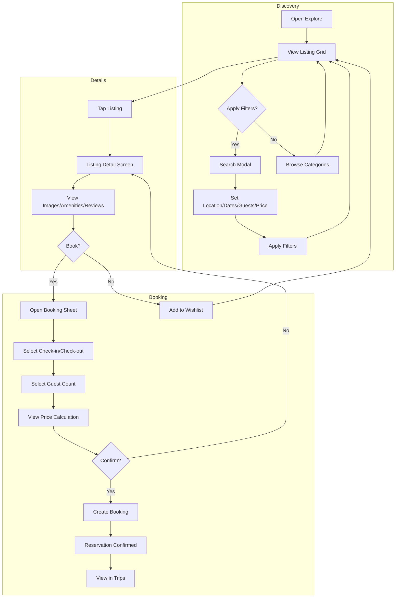
```mermaid
flowchart TD
    subgraph Discovery
        A[Open Explore] --> B[View Listing Grid]
        B --> C{Apply Filters?}
        C -->|Yes| D[Search Modal]
        D --> E[Set Location/Dates/Guests/Price]
        E --> F[Apply Filters]
        F --> B
        C -->|No| G[Browse Categories]
        G --> B
    end

    subgraph Details
        B --> H[Tap Listing]
        H --> I[Listing Detail Screen]
        I --> J[View Images/Amenities/Reviews]
        J --> K{Book?}
    end

    subgraph Booking
        K -->|Yes| L[Open Booking Sheet]
        L --> M[Select Check-in/Check-out]
        M --> N[Select Guest Count]
        N --> O[View Price Calculation]
        O --> P{Confirm?}
        P -->|Yes| Q[Create Booking]
        Q --> R[Reservation Confirmed]
        R --> S[View in Trips]
        P -->|No| I
        K -->|No| T[Add to Wishlist]
        T --> B
    end
```

**Search Filters Model:**
```dart
SearchFilters {
  location, latitude, longitude,
  checkIn, checkOut,
  guestCount,
  minPrice, maxPrice,
  propertyTypes[],
  amenities[]
}
```

**Key Files:**
- `lib/screens/explore/explore_screen.dart`
- `lib/screens/explore/listing_detail_screen.dart`
- `lib/state/search_state.dart`
- `lib/models/search_filters.dart`

---

### Host Onboarding Flow

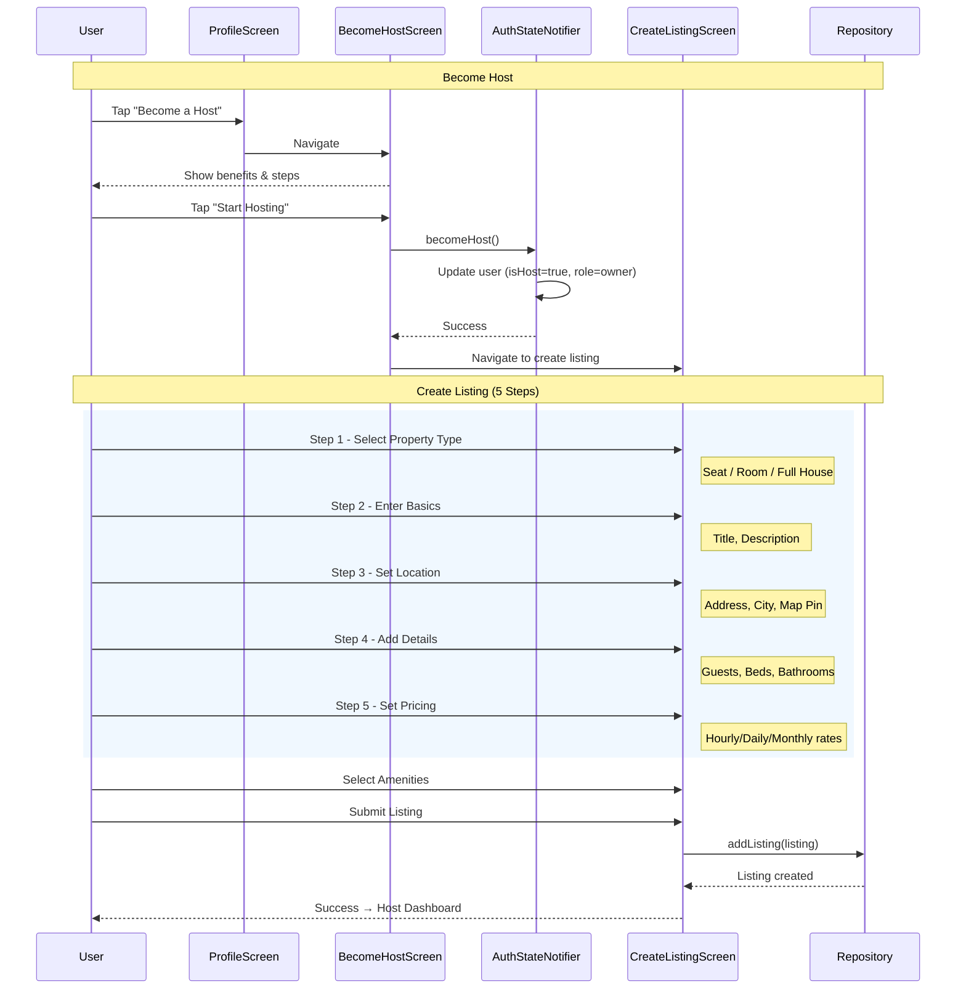
```mermaid
sequenceDiagram
    participant U as User
    participant PS as ProfileScreen
    participant BH as BecomeHostScreen
    participant AS as AuthStateNotifier
    participant CL as CreateListingScreen
    participant R as Repository

    Note over U,R: Become Host
    U->>PS: Tap "Become a Host"
    PS->>BH: Navigate
    BH-->>U: Show benefits & steps
    U->>BH: Tap "Start Hosting"
    BH->>AS: becomeHost()
    AS->>AS: Update user (isHost=true, role=owner)
    AS-->>BH: Success
    BH->>CL: Navigate to create listing

    Note over U,R: Create Listing (5 Steps)
    rect rgb(240, 248, 255)
        U->>CL: Step 1 - Select Property Type
        Note right of CL: Seat / Room / Full House
        U->>CL: Step 2 - Enter Basics
        Note right of CL: Title, Description
        U->>CL: Step 3 - Set Location
        Note right of CL: Address, City, Map Pin
        U->>CL: Step 4 - Add Details
        Note right of CL: Guests, Beds, Bathrooms
        U->>CL: Step 5 - Set Pricing
        Note right of CL: Hourly/Daily/Monthly rates
    end

    U->>CL: Select Amenities
    U->>CL: Submit Listing
    CL->>R: addListing(listing)
    R-->>CL: Listing created
    CL-->>U: Success → Host Dashboard
```

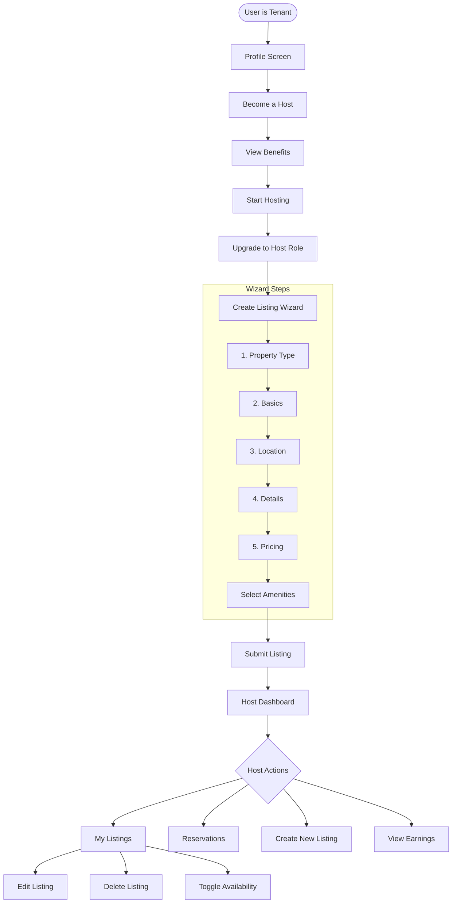
```mermaid
flowchart TD
    Start([User is Tenant]) --> Profile[Profile Screen]
    Profile --> BecomeHost[Become a Host]
    BecomeHost --> Benefits[View Benefits]
    Benefits --> StartHosting[Start Hosting]
    StartHosting --> UpgradeRole[Upgrade to Host Role]

    UpgradeRole --> Wizard[Create Listing Wizard]

    subgraph Wizard Steps
        Wizard --> S1[1. Property Type]
        S1 --> S2[2. Basics]
        S2 --> S3[3. Location]
        S3 --> S4[4. Details]
        S4 --> S5[5. Pricing]
        S5 --> Amenities[Select Amenities]
    end

    Amenities --> Submit[Submit Listing]
    Submit --> Dashboard[Host Dashboard]

    Dashboard --> Actions{Host Actions}
    Actions --> ViewListings[My Listings]
    Actions --> ViewReservations[Reservations]
    Actions --> CreateNew[Create New Listing]
    Actions --> ViewEarnings[View Earnings]

    ViewListings --> EditListing[Edit Listing]
    ViewListings --> DeleteListing[Delete Listing]
    ViewListings --> ToggleAvail[Toggle Availability]
```

**Listing Creation Data:**
```dart
CreateListingData {
  type: ListingType,      // seat, room, fullHouse
  title: String,
  description: String,
  address: String,
  city: String,
  coordinates: LatLng,
  maxGuests: int,
  bedrooms: int,
  beds: int,
  bathrooms: int,
  hourlyRate: double,
  dailyRate: double,
  monthlyRate: double,
  amenities: List<Facility>
}
```

**Key Files:**
- `lib/screens/host/become_host_screen.dart`
- `lib/screens/host/create_listing_screen.dart`
- `lib/screens/host/host_dashboard_screen.dart`
- `lib/screens/host/host_listings_screen.dart`
- `lib/screens/host/host_reservations_screen.dart`

---

### Booking Management Flow

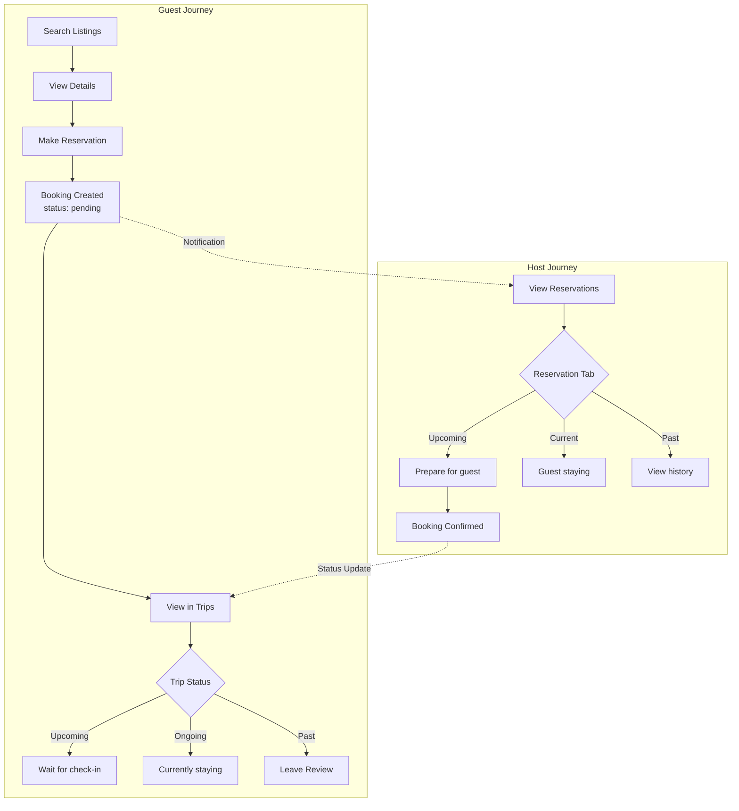
```mermaid
flowchart TD
    subgraph Guest["Guest Journey"]
        G1[Search Listings] --> G2[View Details]
        G2 --> G3[Make Reservation]
        G3 --> G4[Booking Created<br/>status: pending]
        G4 --> G5[View in Trips]
        G5 --> G6{Trip Status}
        G6 -->|Upcoming| G7[Wait for check-in]
        G6 -->|Ongoing| G8[Currently staying]
        G6 -->|Past| G9[Leave Review]
    end

    subgraph Host["Host Journey"]
        H1[View Reservations] --> H2{Reservation Tab}
        H2 -->|Upcoming| H3[Prepare for guest]
        H2 -->|Current| H4[Guest staying]
        H2 -->|Past| H5[View history]
        H3 --> H6[Booking Confirmed]
    end

    G4 -.->|Notification| H1
    H6 -.->|Status Update| G5
```

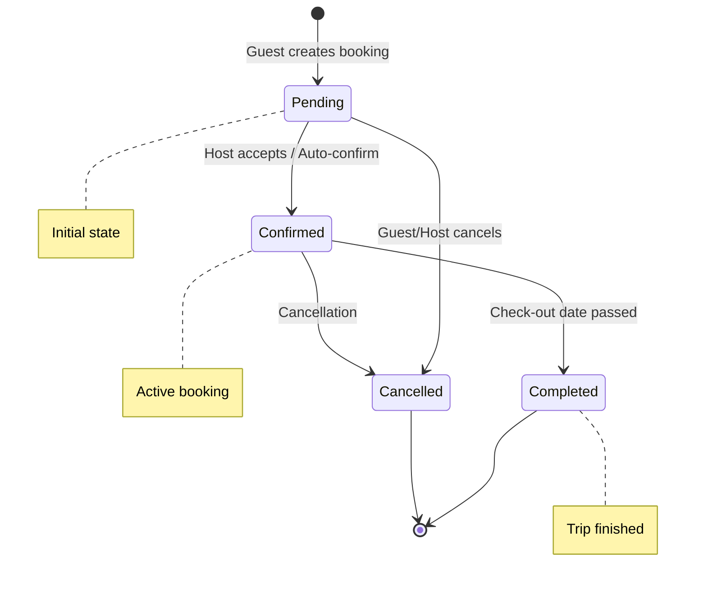
```mermaid
stateDiagram-v2
    [*] --> Pending: Guest creates booking
    Pending --> Confirmed: Host accepts / Auto-confirm
    Pending --> Cancelled: Guest/Host cancels
    Confirmed --> Completed: Check-out date passed
    Confirmed --> Cancelled: Cancellation
    Completed --> [*]
    Cancelled --> [*]

    note right of Pending: Initial state
    note right of Confirmed: Active booking
    note right of Completed: Trip finished
```

**Booking Model:**
```dart
Booking {
  id, listingId, userId,
  checkIn, checkOut,
  guestCount,
  totalPrice,
  status: BookingStatus,
  // Display fields
  listingTitle, listingImageUrl, listingCity
}
```

---

## Data Layer

### Repository Interface

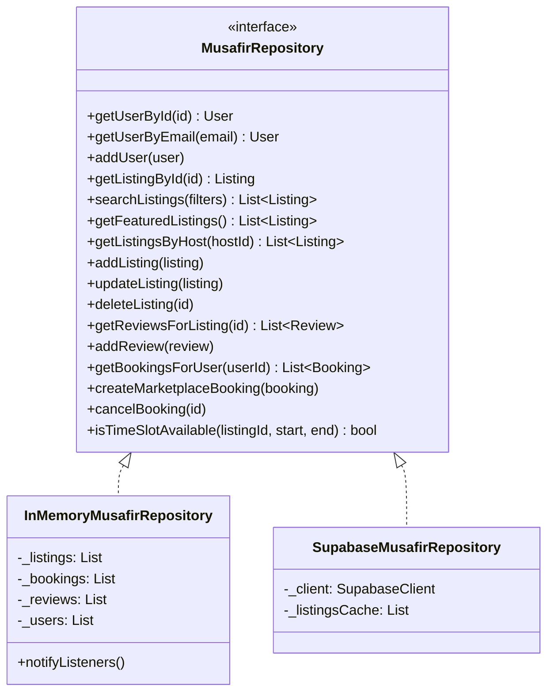
```mermaid
classDiagram
    class MusafirRepository {
        <<interface>>
        +getUserById(id) User
        +getUserByEmail(email) User
        +addUser(user)
        +getListingById(id) Listing
        +searchListings(filters) List~Listing~
        +getFeaturedListings() List~Listing~
        +getListingsByHost(hostId) List~Listing~
        +addListing(listing)
        +updateListing(listing)
        +deleteListing(id)
        +getReviewsForListing(id) List~Review~
        +addReview(review)
        +getBookingsForUser(userId) List~Booking~
        +createMarketplaceBooking(booking)
        +cancelBooking(id)
        +isTimeSlotAvailable(listingId, start, end) bool
    }

    class InMemoryMusafirRepository {
        -_listings: List
        -_bookings: List
        -_reviews: List
        -_users: List
        +notifyListeners()
    }

    class SupabaseMusafirRepository {
        -_client: SupabaseClient
        -_listingsCache: List
    }

    MusafirRepository <|.. InMemoryMusafirRepository
    MusafirRepository <|.. SupabaseMusafirRepository
```

### Data Models

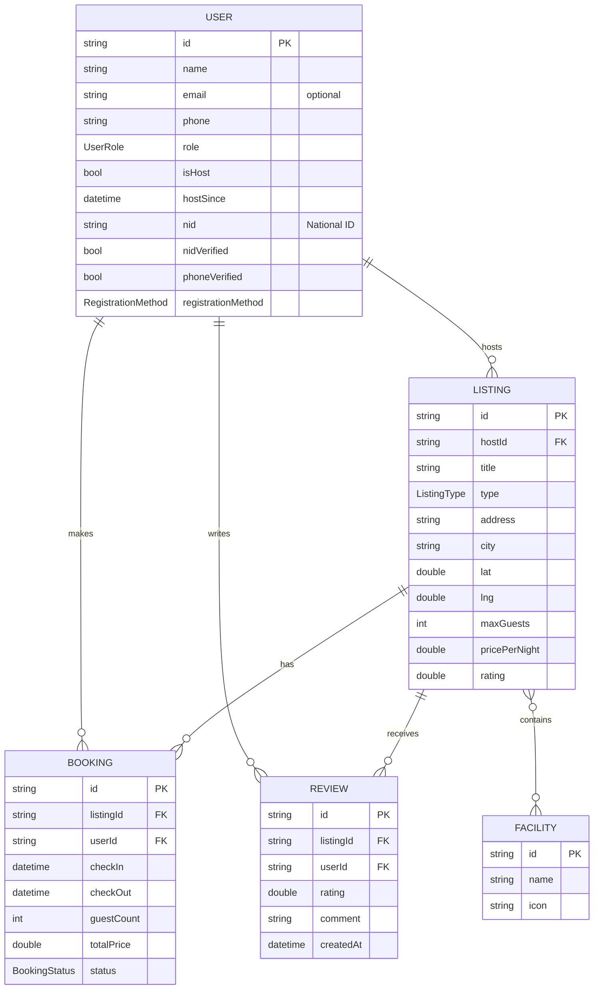
```mermaid
erDiagram
    USER ||--o{ LISTING : hosts
    USER ||--o{ BOOKING : makes
    USER ||--o{ REVIEW : writes
    LISTING ||--o{ BOOKING : has
    LISTING ||--o{ REVIEW : receives
    LISTING }o--o{ FACILITY : contains

    USER {
        string id PK
        string name
        string email "optional"
        string phone
        UserRole role
        bool isHost
        datetime hostSince
        string nid "National ID"
        bool nidVerified
        bool phoneVerified
        RegistrationMethod registrationMethod
    }

    LISTING {
        string id PK
        string hostId FK
        string title
        ListingType type
        string address
        string city
        double lat
        double lng
        int maxGuests
        double pricePerNight
        double rating
    }

    BOOKING {
        string id PK
        string listingId FK
        string userId FK
        datetime checkIn
        datetime checkOut
        int guestCount
        double totalPrice
        BookingStatus status
    }

    REVIEW {
        string id PK
        string listingId FK
        string userId FK
        double rating
        string comment
        datetime createdAt
    }

    FACILITY {
        string id PK
        string name
        string icon
    }
```

**User Model Fields:**
```dart
User {
  id, name,
  email?,                    // Optional for phone registration
  phone?,
  avatarUrl?,
  role: UserRole,
  createdAt?,
  // Host fields
  isHost, hostSince?, bio?, responseRate?, responseTime?,
  // Verification fields
  nid?,                      // National ID number
  nidVerified: bool,         // NID verification status
  phoneVerified: bool,       // Phone verification status
  registrationMethod?: RegistrationMethod  // 'email' or 'phone'
}
```

---

## State Management

### State Architecture

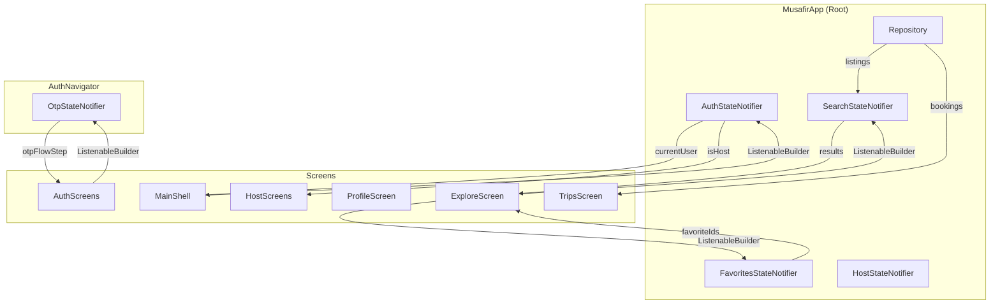
```mermaid
graph TD
    subgraph App["MusafirApp (Root)"]
        Repo[Repository]
        Auth[AuthStateNotifier]
        Search[SearchStateNotifier]
        Favs[FavoritesStateNotifier]
        Host[HostStateNotifier]
    end

    subgraph AuthNav["AuthNavigator"]
        Otp[OtpStateNotifier]
    end

    subgraph Screens
        MS[MainShell]
        ES[ExploreScreen]
        TS[TripsScreen]
        PS[ProfileScreen]
        HS[HostScreens]
        AS[AuthScreens]
    end

    Repo -->|listings| Search
    Auth -->|currentUser| MS
    Auth -->|isHost| HS
    Search -->|results| ES
    Favs -->|favoriteIds| ES
    Repo -->|bookings| TS
    Otp -->|otpFlowStep| AS

    MS -->|ListenableBuilder| Auth
    ES -->|ListenableBuilder| Search
    ES -->|ListenableBuilder| Favs
    AS -->|ListenableBuilder| Otp
```

### State Notifiers

| Notifier | Purpose | Key State |
|----------|---------|-----------|
| `AuthStateNotifier` | User session & auth | `currentUser`, `isLoading`, `error` |
| `OtpStateNotifier` | Phone auth flow | `currentStep`, `phoneNumber`, `resendCountdown`, `expiryCountdown` |
| `SearchStateNotifier` | Listing discovery | `filters`, `results`, `allListings` |
| `FavoritesStateNotifier` | Saved listings | `favoriteIds` (Set) |
| `HostStateNotifier` | Host mode UI | `isHostMode` |

**OtpStateNotifier Flow Steps:**
```dart
enum OtpFlowStep {
  phoneEntry,         // Enter phone number
  otpVerification,    // Verify OTP code
  profileCompletion,  // Complete profile with NID
  complete            // Registration complete
}
```

---

## Key Components

### Screen Navigation

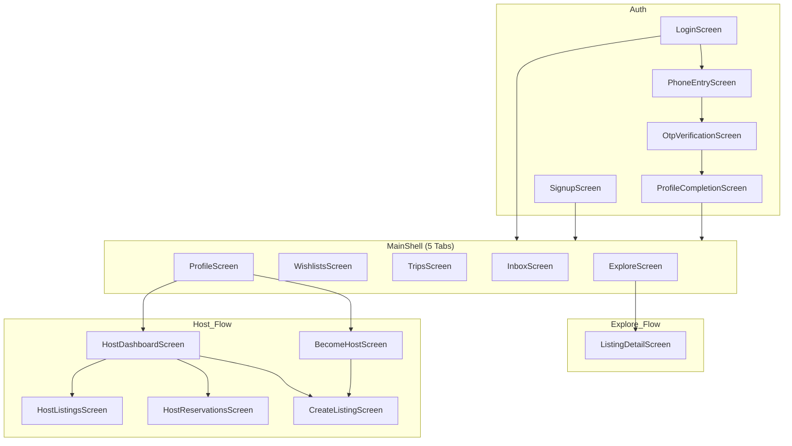
```mermaid
graph TD
    subgraph Auth
        Login[LoginScreen]
        Signup[SignupScreen]
        PhoneEntry[PhoneEntryScreen]
        OtpVerify[OtpVerificationScreen]
        ProfileComplete[ProfileCompletionScreen]
    end

    subgraph Main["MainShell (5 Tabs)"]
        Explore[ExploreScreen]
        Wishlists[WishlistsScreen]
        Trips[TripsScreen]
        Inbox[InboxScreen]
        Profile[ProfileScreen]
    end

    subgraph Explore_Flow
        Explore --> ListingDetail[ListingDetailScreen]
    end

    subgraph Host_Flow
        Profile --> BecomeHost[BecomeHostScreen]
        Profile --> HostDash[HostDashboardScreen]
        HostDash --> HostListings[HostListingsScreen]
        HostDash --> HostRes[HostReservationsScreen]
        HostDash --> CreateListing[CreateListingScreen]
    end

    Login --> Main
    Signup --> Main
    Login --> PhoneEntry
    PhoneEntry --> OtpVerify
    OtpVerify --> ProfileComplete
    ProfileComplete --> Main
    BecomeHost --> CreateListing
```

### Widget Library

| Widget | Purpose |
|--------|---------|
| `ListingCardModern` | Grid card for listing display |
| `CategoryScroll` | Horizontal property type filter |
| `AreaMapPreview` | Static map preview |
| `LocationPicker` | Full-screen map selection (host "Pick on Map") |
| `MapPlaceSearchBar` | Type-ahead place search floating over a map |
| `AppTextField` | Styled text input |
| `PhoneInputField` | BD phone input with +880 prefix & flag |
| `OtpInputField` | 4-digit OTP boxes with auto-focus |
| `NidInputField` | NID input with 10/17 digit validation |

### Services

| Service | Capabilities |
|---------|--------------|
| `LocationService` | GPS position (geolocator — works on web too) |
| `GeocodingService` | Place name ⇄ coordinates, web-safe (see below) |
| `PlacesService` | Google Places type-ahead + place → coordinates |

#### Two traps when a screen sits on a map

1. **The `geocoding` package is Android/iOS only.** It ships no web
   implementation, so `locationFromAddress` / `placemarkFromCoordinates` throw
   from a browser — and both call sites caught the error and returned nothing,
   which is why the host's map search looked dead rather than broken. Anything
   that resolves a place must go through `GeocodingService` or `PlacesService`,
   which fall back to the `geocode` / `places-search` edge functions.
2. **On web a Google map is a DOM element that wins the browser's hit-test.**
   Flutter controls painted over it — search bars, buttons, even the app bar —
   never receive the tap unless they are wrapped in a `PointerInterceptor`.
   The centre pin is the exception: it must stay `IgnorePointer` so the map can
   still be panned under it.
| `OtpService` | OTP generation, storage, verification with expiry & attempt tracking |
| `SmsGateway` | SMS sending interface (Console, BulkSMS BD, Alpha SMS, Zaman IT) |
| `NidVerificationService` | NID verification interface (Bypass for dev) |

---

## API Integration Points

### Current: In-Memory

- All data stored in memory
- Seeded with mock data on startup
- Lost on app restart

### Future: Supabase

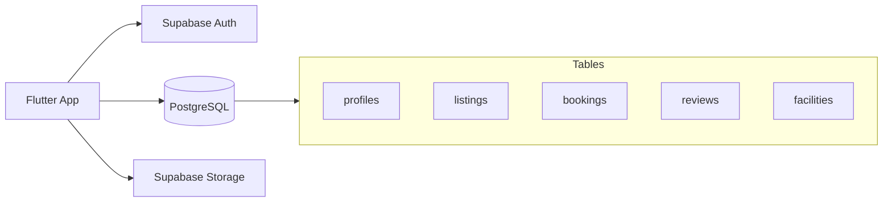
```mermaid
graph LR
    App[Flutter App] --> Auth[Supabase Auth]
    App --> DB[(PostgreSQL)]
    App --> Storage[Supabase Storage]

    DB --> Tables
    subgraph Tables
        users[profiles]
        listings[listings]
        bookings[bookings]
        reviews[reviews]
        facilities[facilities]
    end
```

**Migration Path:**
1. Configure `lib/config/supabase_config.dart`
2. Implement `SupabaseMusafirRepository` methods
3. Replace `InMemoryMusafirRepository` in `app.dart`
4. Move auth to Supabase Auth
5. Add real-time subscriptions for live updates
6. Configure SMS gateway with real provider credentials
7. Integrate real NID verification API

---

## Security Considerations

| Area | Current | Recommended |
|------|---------|-------------|
| Auth | Mock (any password works) | Supabase Auth with OAuth |
| Phone Auth | OTP via console | Real SMS gateway with rate limiting |
| NID | Bypass (always true) | Real NID verification API |
| Data | Client-side only | Row Level Security (RLS) |
| API Keys | Config file | Environment variables |
| Payments | Not implemented | Stripe with server-side validation |

---

## Performance Optimizations

- **Lazy loading**: Listings loaded on demand
- **Client-side filtering**: Fast filter application without network
- **Image caching**: Flutter's built-in image cache
- **Indexed navigation**: `IndexedStack` preserves tab state
- **OTP caching**: In-memory storage with automatic expiry

---

## Future Enhancements

| Feature | Priority | Notes |
|---------|----------|-------|
| Payment Integration | High | Stripe/PayPal for bookings |
| Real-time Messaging | High | Supabase Realtime for inbox |
| Push Notifications | Medium | Booking updates, messages |
| Reviews System | Medium | Post-stay reviews |
| Real SMS Gateway | Medium | Configure BulkSMS BD/Alpha/Zaman IT |
| Real NID Verification | Medium | Bangladesh NID API integration |
| Calendar Sync | Low | iCal export for hosts |
| Multi-language | Low | i18n support |

---

## Quick Reference

**Demo Credentials:**
| Email | Password | Role |
|-------|----------|------|
| demo@musafir.com | password123 | Tenant |
| owner@musafir.com | password123 | Host |
| admin@musafir.com | password123 | Admin |

**Phone Registration:**
- Enter any valid BD number (01XXXXXXXXX)
- OTP will be printed to console
- NID verification is bypassed in dev mode

**Key Entry Points:**
- `lib/main.dart` - App bootstrap
- `lib/app.dart` - Dependency setup & AuthNavigator
- `lib/screens/main_shell.dart` - Main navigation

**Run Commands:**
```bash
flutter run              # Debug mode
flutter run --release    # Release mode
flutter build apk        # Android APK
flutter build ios        # iOS build
```
