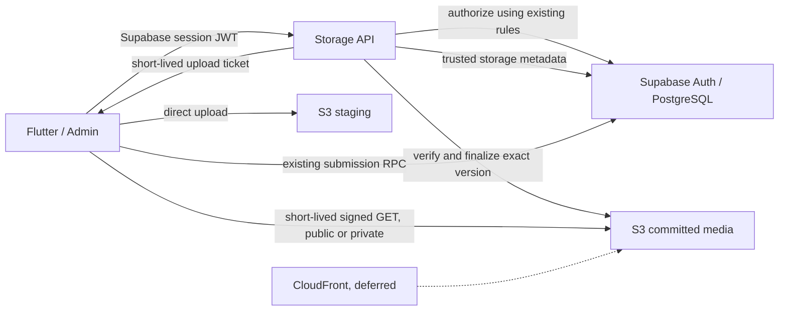

# Supabase Storage to AWS S3 migration plan

Status: planning only. No application code, database, AWS infrastructure, stored media, permissions or live settings changed by this plan.

Prepared: 2026-09-27. Revised 2026-10-02 against the live database (Management API), the deployed edge-function list, both repositories and migrations through 155. Live figures below are from that day; re-measure before implementation, but the shape of the system is now known rather than assumed. Traffic, AWS account/region and Android install counts are still unmeasured.

## 1. Scope and recommendation

Move all application-uploaded files from Supabase Storage to Amazon S3. Keep Supabase PostgreSQL, Auth, Realtime and existing business RPCs. S3 is object storage, not a replacement for transactional database records. Keep Flutter web hosting, its bundled MediaPipe model/WASM and other shipped app assets on Cloudflare; they are deployment artifacts, not uploads. Moving hosting, database backups or logs is a separate project.

The live inventory is small: 116 objects, about 43 MB, across four buckets, and the fifth (`chat-attachments`) has never received an upload. The design is sized for that, not for a hypothetical large store.

Recommended design: a Supabase Edge Function as the storage signer (the project already deploys and pins edge functions), presigned POST uploads to S3 Standard, S3 signed GETs for every read including currently public media, and a two-table provider-neutral metadata registry in PostgreSQL. CloudFront is deferred until measured traffic justifies a CDN. Use adapters in Flutter and admin. Start with avatars/listing media, then sensitive documents and face evidence; chat has nothing to copy and only needs the adapter. Keep the Supabase adapter throughout coexistence and rollback.

This is a moderate effort migration. The difficult parts are authorization equivalence, immutable review evidence, the installed Android app and the URLs already copied into business rows—not copying 116 files.

A hard constraint: an installed app that directly calls Supabase Storage cannot be redirected to S3 by changing a server setting. Web is the primary target and reloads itself; this constraint is about Android (live on Play at `versionCode` 4). Immediate total removal of Supabase Storage and uninterrupted support for that client are incompatible. Preserve service while it upgrades, or raise the existing `app_settings.android_min_version_code` floor as an explicit decision; retire the old storage path only after that.

## 2. Behavior that must remain unchanged

- Account authentication, roles, suspension rules and admin privileges.
- Listing creation/editing, gallery ordering, cover images, image compression, avatar replacement and chat send/retry behavior.
- All five identity-document options; NID needs front/back, other options retain their present rules.
- Separate document and face statuses, evidence submission, manual review, mandatory admin approval, revocation and audit history.
- Booking and listing-publishing eligibility, payments, pricing, notifications and messaging authorization.
- Face attempt nonce, expiry, daily attempt limit, capture feature toggle, guided/manual distinction, size limits and evidence-version checks.
- Existing owners, document paths, verdicts, reviewer identities, timestamps and already-issued records.
- Public versus private access semantics, unless a separately approved security change explicitly revises them.

“No business logic change” does not mean “no SQL changes.” Storage-dependent SQL must use a new evidence lookup without weakening the existing validation or altering its state transitions. An upload finishing must never approve a person or submit a business record automatically.

## 3. Current storage inventory

Limits and policies below were read from the live database on 2026-10-02 and match `supabase/baseline/live_baseline.sql`; stricter workflow limits still apply. Every live object has a non-null `owner`.

| Logical bucket | Live objects | Access today | Bucket limit | Uses and special constraints |
| --- | ---: | --- | --- | --- |
| `avatars` | 7 (274 kB) | Public reads | 2 MiB; JPEG/PNG/WebP | App/admin profile photos; stable `{userId}.{ext}` keys; replacement and cache busting |
| `listing-images` | 45 (12 MB) | Public reads | 5 MiB; JPEG/PNG/WebP | Listing galleries, cards and social previews; listing ID prefix |
| `chat-attachments` | 0 | Public reads | 10 MiB; listed image, PDF, Office and text types | Chat photos/files; conversation prefix; URL stored in `messages.metadata->>'url'`. Wired in the app, never used |
| `documents` | 50 (21 MB) | Owner/admin signed reads | 10 MiB; JPEG/PNG/WebP/PDF | Identity images, legacy selfies, address proofs and, since migration 152, hotel trade licences (`listing_trade_licences.document_path`). Identity RPC restricts images to JPEG/PNG, 100 bytes–5 MiB. Only the `/nid/` prefix is protected from owner update/delete; passport, driving, student, office and trade-licence files are owner-mutable after submission |
| `face-evidence` | 14 (10 MB) | Owner/admin signed reads | 8 MiB; JPEG/WebM/MP4 | Selfie 100 bytes–512 KiB, video 100 bytes–8 MiB; draft-attempt ownership/expiry; immutable capture objects |

Important existing behaviors, each confirmed against the nineteen live `storage.objects` policies:

- Chat attachment bytes are publicly accessible by URL even though messages have their own authorization. Making them participant-only is a valuable separate privacy improvement, but is not a behavior-preserving storage migration. Do not silently describe current chat files as private.
- Listing upload authorization calls `can_upload_listing_image()`: publishing eligibility **or an existing owned listing**. It is not simply a target-listing ownership check. Uploads can precede listing creation. Replacing this with “listing row must already exist” would break current flows.
- Chat storage insert currently requires authentication, not conversation membership. Preserve the current baseline in parity tests; flag stronger authorization as a separate decision rather than hiding it in the migration.
- Submitted non-NID evidence is mutable by its owner today (see the `documents` row). The migration either carries that or a separate change freezes submitted evidence; it must not do either silently. Decision in §16.
- Storage object owner fields drive the listing-image and chat update/delete policies. Copying bytes as a migration service must not change logical ownership to that service.
- Public full URLs and private object paths coexist. Signed URLs must never become durable database identifiers.
- Admin upload code (`storage-actions.ts`) uses the service-role client when `SUPABASE_SERVICE_ROLE_KEY` is set, else the session client, issues signed upload tickets and sends bytes directly from the browser, avoiding Next.js action body limits. Admin signs face evidence for 300 s and documents for 3600 s.

### Code and SQL touchpoints

| Area | Existing locations | Required migration work |
| --- | --- | --- |
| Shared Flutter uploads/downloads/deletes | `lib/services/image_upload_service.dart` (also uploads trade licences and chat files, and signs document URLs) | Preserve API/results/progress/compression; delegate storage transport |
| Identity and face uploads | `lib/services/verification/nid_verification_service.dart`, `face_verification_service.dart` | Add authorized upload/finalize operation; retain existing submit RPC calls |
| URL-to-key parsing | `_storagePathFromUrl` in BOTH `lib/screens/host/edit_listing_screen.dart` and `lib/screens/host/property_form_screen.dart` | One resolver for both; resolve legacy URLs and new media references safely; preserve deletion behavior |
| Messaging | `lib/screens/messaging/chat_screen.dart`, `messages.metadata` jsonb | Preserve filename, size, MIME and URL shapes; cover previews and file opening |
| Admin uploads | `musafir-admin/src/lib/storage-actions.ts`, `src/components/image-upload.tsx`, `src/lib/images.ts` | Keep `requireAdmin`; replace signed-upload transport; preserve cleanup and cache behavior |
| Admin private readers | `verifications/page.tsx`, `verifications/faces/page.tsx`, `users/queries.ts` | Batch authorization and URL signing across both providers |
| Evidence SQL | `submit_face_verification`, `submit_identity_document`, `approve_identity_document`, NID compatibility wrappers, and (152) `submit_trade_licence`, `review_trade_licence`, `listing_licence_verified` | Replace direct `storage.objects` evidence reads with trusted provider-aware lookup |
| Retention | `orphan_face_evidence`, `record_face_evidence_deleted`, `supabase/functions/purge-face-evidence/index.ts` | **Not deployed and not scheduled today** (§10). Deploy, schedule, then make provider-aware |
| Social previews | `worker/index.js` emits the first `listings.image_urls` entry verbatim as `og:image` | Keep absolute public image URLs functional for crawlers; no private URLs in preview tags; `sh tool/verify_link_previews.sh` |
| Denormalised URL copies | `bookings.listing_image_url`, `reviews.reviewer_avatar_url`, `listings.host_avatar_url`, `notifications.image_url` | §8 rewrite surface; `bookings.listing_image_url` is a frozen snapshot column |

Re-scan all repositories, functions, jobs, tests and actual deployed schema before implementation. The table is the known migration surface as of migration 155, not a promise that no other dependency exists.

## 4. Target architecture



Use separate production and staging resources. Prefer separate physical buckets for public media, private documents, face evidence and upload staging so their access/retention policies cannot be confused. Logical bucket names remain unchanged in adapters; public media can share a physical bucket with separate prefixes. All physical S3 buckets have Block Public Access enabled and ACLs disabled.

“Public media” is served by signed GETs with a long TTL at first; at 7 avatars and 45 listing images there is no CDN case yet. When traffic justifies it, add CloudFront with origin access control on a domain the project owns (`media.<owned-domain>`); its distribution must not have access to private buckets. The URL shape handed to clients must be opaque enough that adding a CDN later does not change stored references (§5).

### Storage API hosting choice

Recommended default: a Supabase Edge Function signs uploads and reads. The project already deploys, pins (`supabase-js@2.45.4`) and `deno check`s edge functions in CI, and the signer needs the same database access those functions already have. It needs an AWS IAM user with a key scoped to the signer's prefixes and actions, stored as a function secret; rotate it like the other secrets. Do not pretend the Deno runtime receives an AWS role.

Alternative if the AWS footprint grows: API Gateway + Lambda with an execution role, which removes the long-lived key but adds a second deployment pipeline and a database integration that does not exist today. Decide once during the proof of concept; implement one backend, not both.

JWT verification: live Auth signs with an ES256 key (`in_use`) and keeps the HS256 key as `previously_used`, both since 2026-05-19. Verify signature, issuer, audience and expiry against `/auth/v1/.well-known/jwks.json`, and accept both `kid`s until the HS256 key is revoked. Check current database role/suspension/resource rules where existing behavior requires them, rather than trusting client-supplied roles. Pass caller identity through a constrained authorization operation; never use a service credential as a substitute for caller authorization.

## 5. Storage contract and trusted registry

Preserve existing business-facing method signatures where practical. A shared storage contract provides:

- `beginUpload(kind, logicalResource, filename, declaredSize, declaredType, idempotencyKey)`
- direct client upload using the returned form/headers
- `finalizeUpload(uploadId)` returning the existing success/path/public-URL result shape
- `getReadUrls(logicalReferences)` and `deleteObject(logicalReference)`

Clients may name an authorized logical resource, never an arbitrary physical bucket/key, AWS account, URL or object version. The backend derives storage keys and binds tickets to the caller and intended resource. Validate resource IDs without introducing new business prerequisites, such as requiring a draft listing to be saved before an image upload.

Proposed additive tables, two rather than four because the inventory is 116 objects:

- `storage_upload_intents`: caller, logical bucket/path, staging key, expected MIME/size, idempotency key, expiry, finalization state.
- `storage_assets`: opaque asset ID, logical bucket/path, original owner, active generation, verified MIME/size/checksum, business-created time, retention deadline, deletion state, and per-provider location columns (Supabase path; S3 bucket/key/pinned version/verified checksum). Two verified locations are enough for coexistence and rollback.

Copy/delete work and tombstones are rows in `storage_assets` with a state column, not a separate outbox; split one out only if a backlog ever exists.

Authenticated clients cannot insert “verified” metadata, choose owners, or mutate provider locations. Use constrained backend-only operations and RLS/revoked grants. A caller cannot make an unuploaded file look real by inserting a database row.

Keep current private logical paths and RPC signatures. Introduce a storage-evidence lookup used by the existing RPCs: verified S3 metadata for migrated assets, existing Supabase metadata for legacy assets. Define precedence explicitly; never accept a conflicting legacy object merely because one exists. Do not insert synthetic S3 rows into Supabase's managed `storage.objects` schema.

## 6. Upload completion and evidence integrity

S3 and PostgreSQL have no shared transaction. Use an explicit state machine:

`authorized → uploaded to staging → verified → committed storage metadata → attached/submitted by existing business RPC`

Recommended initial upload mechanism: short-lived presigned POST to a unique staging key, with exact key/MIME conditions and `content-length-range`. Current files are at most 10 MiB, so multipart complexity is unnecessary initially. Maintain upload progress and cancellation on web/mobile. [AWS POST policy](https://docs.aws.amazon.com/AmazonS3/latest/developerguide/sigv4-HTTPPOSTConstructPolicy.html)

Finalization must:

1. Recheck intent, caller and relevant current authorization/attempt expiry.
2. Obtain object metadata independently from S3, pin the staging version, and verify actual size/checksum and supported content format. Client Content-Type is a claim, not evidence of bytes.
3. Promote that exact version to a backend-only immutable committed key; record the resulting physical version. Lock/idempotently claim the intent so concurrent finalizers cannot attach competing versions.
4. Commit trusted registry metadata only after the final object is confirmed. If the database commit fails, retry finalization without duplicating business submission. Reconcile abandoned committed objects later.
5. Return success to the existing caller, which then uses the existing document/face/message/listing workflow.

Presigned URLs are reusable until expiry; they are not single-use. A same-key upload can replace bytes. Unique staging versions and version-pinned promotion prevent a replay from changing submitted evidence. A direct-to-final PUT alternative needs correctly signed/enforced conditional writes and an independently proven size-control solution; do not assume POST policy conditions apply to PUT. [Presigned URL behavior](https://docs.aws.amazon.com/AmazonS3/latest/userguide/using-presigned-url.html), [conditional writes](https://docs.aws.amazon.com/AmazonS3/latest/userguide/conditional-writes.html)

Admin review URLs must resolve the exact immutable evidence generation/version that approval checks. Existing admin-only, no-self-review and stale-evidence protections remain. Malformed uploads must not become visible or count as submitted. Deep malware scanning for chat Office/PDF files can add delay/new rejection behavior: evaluate it as an explicit security enhancement, not a hidden migration rule.

## 7. Security controls

- Separate API signer, finalizer, migration, retention and deployment roles. Grant only required bucket prefixes/actions; end-user tickets never grant list/delete or private read access.
- HTTPS only. Encryption at rest on every bucket. Evaluate SSE-KMS for private evidence; record KMS request cost, permissions, recovery and key-disable failure scenarios before selecting it. Encryption does not replace access control.
- Preserve private signed-link TTLs per caller: current face queue uses 300 seconds; document readers have their own existing TTLs. Sign again after expiry. Immediate revocation of an already issued bearer URL is not guaranteed; do not promise it.
- Exact allowed web origins/methods/headers in CORS, including checksum/form headers and any conditional headers used. Test admin and Flutter origins. CORS is not authorization and does not protect against native clients.
- No AWS secrets in Dart, browser JavaScript, app config, logs or git. Do not log presigned URLs, bearer tokens, face bytes or document numbers. Use opaque request/asset IDs in logs.
- Preserve all current MIME/size restrictions; configure download headers so supported attachments cannot execute as HTML on the application origin. Never place untrusted uploads on the app's authenticated origin.
- Rate-limit ticket creation and concurrent uploads; bound staging lifetime and storage abuse. Tune operational limits against current valid workloads rather than inventing new verification quotas.
- Public CDN deletion must invalidate affected cached paths when current semantics require removal. Ensure private objects cannot enter a public origin/cache path, including through fallback logic.
- Object Lock is not the default: its deletion restrictions can conflict with face-evidence retention. Use denied overwrite/delete privileges, immutable generations and version-pinned reads instead.

## 8. Existing URLs and older app versions

Live reference inventory, 2026-10-02:

| Column | Rows with a Supabase storage URL |
| --- | ---: |
| `profiles.avatar_url` | 7 of 7 |
| `listings.image_urls` (text[]) | 22 of 22 |
| `bookings.listing_image_url` (frozen snapshot) | 46 of 106 |
| `reviews.reviewer_avatar_url` | 14 of 14 |
| `listings.host_avatar_url`, `notifications.image_url` | 0, columns exist |
| `messages.metadata->>'url'` | 0 |

Private paths, not URLs: `face_verification_attempts.selfie_path` / `clip_path`, `owner_documents.file_path`, `profiles.address_proof_path`, `listing_trade_licences.document_path`. These need no rewrite; the resolver maps a path to a provider.

`bookings.listing_image_url` is a frozen column under the payments hardening (136–140): rewriting it is a change to a frozen row and needs its own decision, otherwise the read-only legacy copy below covers it. Retain an exact before/after mapping and reference counts. Do not blindly replace all occurrences of a hostname in database text or fetch arbitrary external URLs during migration.

A resolver recognizes allowlisted legacy Supabase URL shapes and new media URLs, handles encoding/query parameters once, and returns a logical asset reference. External image URLs remain external. Private signed URLs are not copied as durable references. Update the listing deletion parser as well as image display.

Recommended compatibility sequence:

1. Publish storage-adapter-capable app/admin versions while Supabase remains authoritative.
2. Copy Supabase objects to S3 and reconcile new writes, replacements and deletions. New clients can read verified S3 replicas; old clients keep using Supabase.
3. Keep Supabase as the write authority while old clients remain active. This avoids silently splitting mutable avatar writes across two independent stores.
4. Before S3 becomes write-authoritative, demonstrate that supported active clients understand the new protocol. Web reloads itself, so this is about the Android app (Play `versionCode` 4). The floor already exists: `app_settings.android_min_version_code` (`docs/notes/android.md`; Play's answer is checked before the floor, zero forces nobody). Raising it is one setting but a separate rollout decision, not something this migration silently does.
5. Cut over by logical bucket/cohort. Preserve legacy URLs and copies for the agreed overlap; then rewrite only verified stored public references with compare-and-swap updates and an undo map.

The project cannot redirect a Supabase-owned hostname using its own DNS. Historical messages/bookmarks/cached payloads with those URLs may require keeping a read-only Supabase copy longer. Document that unavoidable exception. “All storage now on S3” is not an honest completion claim while these dependencies remain.

Supabase read fallback is per-object and only for a verified same-generation replica. Never turn an authorization error or a deletion tombstone into a fallback read. Never accept arbitrary user-provided fallback URLs.

## 9. Data migration and concurrent changes

Preflight: export an object manifest through supported Storage APIs, bucket policies/limits, ownership metadata, reference snapshots, count/byte totals and business verdict fingerprints. Enumerate actual production jobs. Do not download sensitive user media to developer laptops for testing.

Use a restricted server-side migration job, streaming provider-to-provider without loading whole buckets into memory. Record per-object source identity, size, MIME, checksum, observed modification time, original business time and destination version. Verify bytes/checksum; ETag alone is not a universal content hash. Bound concurrency, retry with backoff, checkpoint every object and resume safely.

Copy only: no source deletion in the initial pass. Reconcile changes during copying, including deletes and mutable avatar replacement. For a changed source generation, repeat verification before marking its replica current. A tombstone wins over a delayed copy job. Counts alone are insufficient—verify references and generations as well.

Preserve original retention deadlines; migration time must not restart a 30-day clock. Use conditional database updates so an old manifest cannot overwrite a user's newer avatar or gallery edit. Unreferenced objects require investigation and the existing orphan policy, not automatic deletion simply because one scan found no reference.

## 10. Retention and deletion

The existing face cleanup code targets evidence older than 30 days and abandoned draft/superseded attempts after their expiry grace period, plus orphans. **It is not running.** On 2026-10-02 `purge-face-evidence` was absent from the deployed function list and nothing in `cron.job` invokes it; `orphan_face_evidence` and `record_face_evidence_deleted` exist in the database with no caller. The 30-day deadline is unenforced today, and the 14 live face objects include evidence older than that. Deploying and scheduling the purge (with `FACE_RETENTION_SECRET`) is a prerequisite that is outward-facing and separately approved; do it against Supabase first so the provider-aware version has a working baseline to be compared with.

Use the existing business deadline as the authoritative clock. A durable deletion job marks the object unavailable, deletes every in-scope provider copy/version, retries failures, then records confirmed deletion using the existing audit mechanism. Do not set `media_deleted_at` while bytes remain retrievable. Pending deletions must not be resurrected by reconciliation or rollback.

Versioned S3 deletion often creates a delete marker; noncurrent versions remain unless separately removed. Enumerate/delete versions for sensitive evidence, including staging copies, replicas and any backups containing it. Lifecycle rules are asynchronous cleanup backstops, not an exact business deadline or proof of deletion. Avoid blanket lifecycle rules that remove pending/referenced documents or unexpectedly change historical retention. [AWS lifecycle semantics](https://docs.aws.amazon.com/AmazonS3/latest/userguide/intro-lifecycle-rules.html), [lifecycle timing](https://docs.aws.amazon.com/AmazonS3/latest/userguide/troubleshoot-lifecycle.html)

## 11. Availability and recovery

Use S3 Standard in one selected region initially; compare Bangladesh upload/download performance and Supabase/API round trips before choosing the region. Do not select an archival or single-AZ class for active verification media. Public CloudFront cache hits reduce origin load, but do not make the database, signer or private downloads independent of their dependencies.

S3 provides strong read-after-write consistency; remaining races are primarily application coordination, CDN caching and cross-provider replication, not a reason to add blind sleeps after upload. [AWS consistency model](https://docs.aws.amazon.com/AmazonS3/latest/userguide/Welcome.html#ConsistencyModel)

Proposed operational targets, to validate in staging rather than promise as an SLA:

- Upload/read-control API availability target: 99.9% monthly, excluding deliberate authorization rejections.
- A completed new upload means its selected provider bytes and registry metadata are confirmed. Pending upload intents must remain retryable after process failure.
- For control-plane failures, preserve retryable user state and show a clear error; never fall back to public private-file access.
- Reconcile migration/delete backlogs with age alarms; initial mirror-lag target under five minutes, measured under expected load.
- Rehearse reverting a read/write routing configuration within 30 minutes. A complete return to Supabase is conditional on reverse-copy verification and may take longer.

CloudFront cache policies must respect avatar version URLs or use unique immutable physical keys. Support video HTTP Range requests and seeking, signed URL expiry during playback, browser redirects, and mobile network changes. Test DNS, certificate, IAM/KMS denial, S3/API throttling and DB outage separately.

Cross-region replication is optional disaster recovery, not an initial prerequisite or instantaneous failover. It adds transfer/storage expense, asynchronous lag, credential/key management and deletion obligations. If adopted, define regional-outage RPO/RTO and test replica/deletion behavior explicitly.

## 12. Rollout stages and exit gates

| Stage | Deliverable | Exit gate |
| --- | --- | --- |
| 0: inventory | Done 2026-10-02 for schema, policies, objects and references (§3, §8). Still open: Android install count, traffic, cost inputs, retention deploy | Business invariants signed off; purge running against Supabase |
| 1: compatibility seam | Supabase-backed adapters, characterization tests, URL resolver. Flutter done 2026-10-02 (`lib/services/storage/`, `test/services/storage/`); admin repo done 2026-10-02 (`src/lib/storage-signer.ts`) | Existing provider behavior unchanged across app/admin |
| 2: AWS staging | Infrastructure as code, IAM, storage API, metadata registry. Built locally 2026-10-02 against MinIO: migration 157 (registry + RPCs, not applied to live), `storage-signer` function, `_shared/s3.ts` + `sniff.ts`, `tool/storage_local.sh`. Cutover pieces built locally 2026-10-02: migration 158 (verifiers read the registry, admin write arms, S3 purge hook; not applied to live), `S3StorageProvider` + `RoutingStorageProvider` (Flutter), signer-routed admin uploads/reads, retention purge by version. AWS IaC still open | Cross-user/admin/anonymous access tests and failure injection pass |
| 3: migration rehearsal | Copy/reconcile jobs, deletion ledger, rollback procedure. Not started: the backfill must run server-side (never via a laptop) | Full fixture inventory reconciles; interrupted jobs resume without duplicates |
| 4: public media pilot | Avatars/listing reads, then chat; small eligible cohort | No broken old URLs, stale avatars, lost messages or unauthorized writes |
| 5: private media pilot | Documents/address proof, then face evidence | Exact evidence approved, immutable bytes, parity of all status/eligibility results |
| 6: S3 write cutover | Compatible client coverage, per-bucket routing, observation. Routing built: the server's `S3_WRITE_BUCKETS` decides per bucket, a client only routes when built with `--dart-define=STORAGE_SIGNER_URL` (admin: `STORAGE_SIGNER_URL` env), and a 421 sends a stale client back to Supabase | Successful controlled uploads/reads/deletes; measured error/latency acceptable |
| 7: retirement | Legacy-client/URL closure and separately approved deletion | All retained objects/references accounted for; rollback window closed explicitly |

Deploy backward-compatible SQL expansion before new upload clients. Compare live definitions with the baseline and take snapshots; this repository's historical migration chain is not safely replayable from scratch. Use the project's baseline workflow and existing rolled-back SQL test pattern. Schema deployment and final destructive retirement need separate authorization during implementation; this document does not authorize them.

Use server-controlled per-bucket read/write routing with explicit generations. Do not ask clients to dual-upload as the only backup mechanism. Keep changes additive until retirement; no bulk deletion on a flag flip.

## 13. Rollback that actually works

Before S3 writes: disable S3 reads and return to the still-authoritative Supabase provider. Preserve copied objects for investigation.

After S3 writes: a feature flag alone is insufficient. Keep the dual-provider reader and metadata expansion deployed. Stop admitting new S3 upload intents; drain or explicitly expire existing tickets (presigned tickets cannot be assumed revoked instantly). Inventory S3-only generations, replay copy operations into Supabase through supported APIs, verify them, preserve original ownership/authorization, and reconcile tombstones. Then route compatible new writes back. Never restore pre-migration SQL while any submitted evidence exists only in S3.

If S3 is unavailable before an unmirrored object can be copied, that object cannot magically be served from Supabase. Document degraded access; do not claim zero-data-loss provider rollback for asynchronous mirrors. If immediate independent-provider recoverability becomes a requirement, require a confirmed second copy before reporting upload success and budget the latency/availability tradeoff explicitly.

Use field-level undo mappings for URL rewrites, not restoration of an old whole database snapshot that would discard new bookings/messages/approvals. Retain new business transactions and audit records during recovery.

## 14. Acceptance tests

Required before production cutover:

- Anonymous, owner, other user, admin and suspended-user matrix for every upload/read/update/delete category, compared with current policies and RPC outcomes.
- Upload-before-listing-save, existing-host eligibility, admin upload to another user's profile/listing, avatar extension replacement and cleanup.
- Every allowed MIME/size boundary, malformed file, expired token, substituted key, replay, duplicate finalization, interrupted upload and cancellation.
- Missing file, missing registry record, forged metadata, attempt expiry, stale evidence, self-review and cross-user review all remain denied.
- NID/passport/driving/student/office ID workflows; manual/guided face submission; existing approval, rejection and revocation behavior unchanged.
- Booking/publishing decisions and relevant profile/document/attempt audit fingerprints unchanged by migration itself.
- Chat send failure/retry, original filenames, PDF/Office downloads, image previews and existing public-link behavior.
- Listing display, editing/deletion and social previews for legacy URLs, new URLs and external images; preserve image order/cover. `sh tool/verify_link_previews.sh` against the pilot listing.
- Signed-link expiry/renewal, video seeking, narrow/mobile UI, CORS, physical Android/iPhone and current web browsers.
- Upload succeeds but DB commit fails; DB commits but response is lost; deletion partially succeeds; copy races overwrite/delete; IAM/KMS denies access.
- Entire test inventory checksum/reference reconciliation, original-owner preservation, rollback after S3-only writes, no deleted-object resurrection.
- Release builds/tests in both repositories; rebuilt tracked Flutter web artifacts using `sh tool/build_web.sh`.

No real identity media is needed for automated tests; use fixtures. A reviewed small production canary should observe counts/errors without exporting private content.

## 15. Effort and cost

Planning estimate for one engineer familiar with both repositories, with AWS access available. These are engineering estimates, not a quote:

| Work | Engineer-days |
| --- | ---: |
| Remaining inventory, authorization characterization, compatibility design | 1–2 |
| Deploy and schedule the face purge against Supabase (prerequisite) | 0.5–1 |
| AWS buckets/IAM, edge-function signer, two registry tables, upload finalization | 3–4 |
| Flutter/admin adapters, one URL resolver, reader changes | 2–4 |
| SQL evidence lookup across seven RPCs | 2–3 |
| Copy/verify/rollback script for 116 objects and five reference columns | 1–2 |
| Integration, security, device tests and staged rollout work | 3–4 |
| Total | 12.5–20 |

Allow roughly 3–4 working weeks plus Play review, observed Android adoption and the agreed rollback window. The 2026-09-27 estimate of 19–29 days assumed API Gateway, CloudFront and a four-table registry; the measured inventory removed those. A public-images-only pilot is smaller but is not completion of “all storage.”

S3 is not guaranteed cheaper or free. Model stored GB-months, object requests, public/private download GB, CloudFront requests/egress, API/Lambda, KMS, logs, versions, replication, temporary staging and Supabase egress during copying. Coexistence temporarily pays for two copies/providers. Use measured traffic and selected-region prices; no defensible monthly amount is available yet. [AWS S3 pricing](https://aws.amazon.com/s3/pricing/)

Cost controls: budgets/alerts, bounded temporary storage, appropriate cache hit rates, clean abandoned multipart uploads if introduced, scoped data-event logging and lifecycle rules aligned with actual retention. Avoid architecture changes merely to claim a lower per-GB headline price.

## 16. Decisions needed before implementation

1. AWS account, budget owner, preferred region/data-location constraints. An owned media domain only when CloudFront is added.
2. Confirmation that “all storage” means uploaded files; this plan keeps database/auth and Cloudflare app hosting.
3. Android support window: either wait for adoption of the adapter build or raise `android_min_version_code`. With neither, full Supabase retirement has no guaranteed date.
4. Edge-function signer (default) versus Lambda, and acceptable provider-outage recovery targets.
5. Whether to keep existing public chat attachment semantics for strict parity or approve a separate participant-only privacy change. Zero objects exist, so parity costs nothing either way.
6. Whether submitted non-NID evidence (passport, driving, student, office, trade licence) stays owner-mutable, as it is today, or is frozen in a separate change before migration.
7. Approval to deploy and schedule `purge-face-evidence` against Supabase now, and whether backup/replication copies may retain sensitive evidence at all.
8. Whether `bookings.listing_image_url`, a frozen column, is rewritten or served from the read-only legacy copy.

These decisions do not block documenting the plan. Until answered, use the defaults above, keep existing behavior, and do not provision or migrate production resources.

## 17. Revision log

- 2026-09-27: first draft from the repository baseline.
- 2026-10-02: verified against live. Measured the object and reference inventory; found `chat-attachments` empty, the face purge undeployed and unscheduled, ES256 JWT signing in use, migration 152's trade-licence evidence, a second URL parser and four denormalised URL columns. Resized the design (edge-function signer, no CloudFront yet, two tables) and the estimate. No live resource was changed.
- 2026-10-02: Stage 1 started. Flutter uploads, signed reads and deletes go through `StorageProvider` (Supabase-only implementation); both `_storagePathFromUrl` copies now call one strict resolver, which no longer keeps a `?query` in the key or matches external URLs.
- 2026-10-02: Stage 2 built locally. Migration 157 adds `storage_upload_intents` / `storage_assets` and RPCs that mirror the 19 live `storage.objects` policies; every decision runs under the caller's JWT, and the signer only holds the S3 key. Uploads use a presigned POST to `staging/{intent}` (policy pins key, type and exact length), then finalize reads the bytes back, checks length and magic bytes, copies that exact version to `{bucket}/{path}@{intent}` and records it. Public reads go through `/media/{bucket}/{path}?g={generation}` (302 to a presigned GET, signed per UTC day so it caches); private reads are presigned for 1 h (documents) or 5 min (face). Verified: SQL suite 39/39, SigV4 against AWS reference vectors, 10 MinIO checks under the scoped key (no list, no anon), 18 end-to-end checks through the signer. Open: a delete leaves a delete marker, so a version-pinned URL that was already issued stays valid until it expires and the old version stays until noncurrent expiry (30 days). That is fine for public media but not for face evidence, whose purge must delete versions (`s3:DeleteObjectVersion`, retention job only).
- 2026-10-02: Write path completed locally (stages 2/4/5/6 code; nothing applied to live, deployed or committed). Migration 158: `storage_object_meta` (registry first, `storage.objects` only when no registry row exists) replaces the `storage.objects` lookups in `submit_face_verification`, `submit_identity_document`, `approve_identity_document`, `submit_trade_licence` and `listing_licence_verified`, with the same size/type limits; a deleted asset satisfies nothing. Admins gain avatar/listing-image write arms (the console no longer needs the service key to upload); `orphan_face_evidence` also scans the registry; `storage_purge_begin` hands the retention job exact versions. Flutter: `defaultStorageProvider()` returns a router when `STORAGE_SIGNER_URL` is compiled in (plain Supabase otherwise, so existing builds are unchanged); uploads follow the server's routing, reads try S3 then Supabase, deletes hit both. `upload` now returns the stored URL so S3 media URLs keep their generation. `storagePathFromUrl` understands `/storage-signer/media/...`. Admin console: uploads, cleanup and the four signed-read sites go through the signer with the admin's own JWT, falling back to Supabase. Retention: `purge-face-evidence` deletes S3 versions with its own `musafir-retention` key (DeleteObjectVersion on the face bucket only). Verified: SQL 158 22/22 (157 39/39, 143/144/152/153 pass; 141's admin-approval check fails as it did before 158), Flutter 1158 tests + 5 real-MinIO e2e (`test/services/storage/storage_minio_e2e_test.dart`), 7 admin-path checks, retention purge left no version or delete marker.

### Running the S3 path locally

```sh
sh tool/storage_local.sh                       # MinIO + scoped users; prints env
# local DB with 157 + 158 applied (tool/local_db_from_live.sh), then the signer:
SUPABASE_URL=http://127.0.0.1:54321 SUPABASE_ANON_KEY=… SUPABASE_SERVICE_ROLE_KEY=… \
S3_ENDPOINT=http://127.0.0.1:9000 SIGNER_PUBLIC_URL=http://127.0.0.1:8000/storage-signer \
<the rest of the printed env> deno run -A supabase/functions/storage-signer/index.ts
flutter run -d chrome --dart-define=SUPABASE_URL=http://127.0.0.1:54321 \
  --dart-define=SUPABASE_ANON_KEY=… \
  --dart-define=STORAGE_SIGNER_URL=http://127.0.0.1:8000/storage-signer
```

Production still needs: AWS buckets/IAM matching `tool/storage_local.sh`, the signer deployed with its secrets (`S3_WRITE_BUCKETS` empty at first), a web/Android build with `STORAGE_SIGNER_URL`, then buckets enabled one at a time (stage 4, then 5).

**2026-10-03.** 157 then 158 applied to live (bojkmonskqlhuakxhzcb) and tracked in `schema_migrations`. The preflight confirmed the six verifier bodies matched what 158 was written against. Afterwards, live function bodies and grants for every `storage_*` function and the six verifiers were identical to local, where the suites pass (157: 39/39, 158: 22/22). This is inert until the signer records objects: the registry is empty, so verifiers keep reading `storage.objects`.

## 18. Production rollout: status and next steps

*As of 2026-10-03. This supersedes the "Production still needs" line above.*

### Done

| Item | State |
|---|---|
| Migrations 157 (registry) and 158 (cutover) | Applied to live, tracked in `schema_migrations`, and identical to local. Inert while the registry is empty. |
| Live edge-function secrets, non-credential | Set: `S3_ENDPOINT` and `S3_PUBLIC_ENDPOINT` (`https://s3.ap-south-1.amazonaws.com`), `S3_REGION=ap-south-1`, `S3_PATH_STYLE=false`, `S3_STAGING_BUCKET`, `S3_BUCKET_PUBLIC`, `S3_BUCKET_DOCUMENTS` and `S3_BUCKET_FACE` (`musafir-bd-{staging,public,documents,face}`), `SIGNER_PUBLIC_URL`. |
| `tool/aws_storage_setup.sh` | Written, not yet run successfully. It is the AWS twin of `tool/storage_local.sh`. It creates the 4 buckets (versioned, public access blocked, lifecycle, CORS) and two least-privilege IAM users, then sets every S3 secret on Supabase. The generated keys are also saved to `~/.config/musafir/supabase-s3-<ref>.env` (mode 600). |
| Local dev mirror | `tool/mirror_media_local.py` copies the live public listings and their images into local Supabase and MinIO. A debug web run (`flutter run -d chrome`) uses the local stack. |

### Blocked

The first run of `aws_storage_setup.sh` failed at `CreateBucket`, its first write, so it created nothing. The bootstrap IAM user `musaafir-s3` has a **permissions boundary** that does not allow `s3:CreateBucket`.

### Not set yet (the script sets them)

- `S3_ACCESS_KEY_ID` and `S3_SECRET_ACCESS_KEY`, for the `musafir-bd-signer` user.
- `S3_RETENTION_ACCESS_KEY_ID` and `S3_RETENTION_SECRET_ACCESS_KEY`, for the `musafir-bd-retention` user.
- `S3_WRITE_BUCKETS` stays **unset on purpose**: unset routes nothing to S3, so deploying the signer is not a cutover.

### Next steps, in order

1. **Unblock IAM.** Sign in as root or an admin, then open IAM → Users → `musaafir-s3`. Remove the permissions boundary and attach `AdministratorAccess`. Alternatively, run step 2 with any other admin key.
2. **Run the setup.** Export the admin key in your own shell; never commit it or paste it anywhere.
   ```sh
    export AWS_ACCESS_KEY_ID=… AWS_SECRET_ACCESS_KEY=…
    PREFIX=musafir-bd sh tool/aws_storage_setup.sh
   ```
   If a `musafir-bd-*` name is taken (bucket names are global across AWS), re-run with another `PREFIX`; the script rewrites the bucket-name secrets to match. It is idempotent.
3. **Retire the bootstrap key.** In IAM, deactivate the key you ran the script with, and remove `AdministratorAccess` from `musaafir-s3`. The signer and the retention job each now hold their own scoped keys.
4. **Check the secrets.** Run `supabase secrets list --project-ref bojkmonskqlhuakxhzcb`. It should show all 13 `S3_*`/`SIGNER_*` names, without `S3_WRITE_BUCKETS`.
5. **Deploy the functions.** Run `supabase functions deploy storage-signer purge-face-evidence --project-ref bojkmonskqlhuakxhzcb`. Both have `verify_jwt = false` in `supabase/config.toml`, so media URLs load without an auth header.
6. **Smoke-test the signer.** `POST {"action":"config"}` with the anon key should answer `{"write_buckets":[]}`.
7. **Ship builds that know the signer.** Add `--dart-define=STORAGE_SIGNER_URL=https://bojkmonskqlhuakxhzcb.supabase.co/functions/v1/storage-signer` to the builds:
   - Web: forward it in `tool/build_web.sh` (not wired yet; about 3 lines) and set it in each GitHub Environment.
   - Android: `flutter build appbundle --release …`.
   - iOS: `flutter build ipa --release …`.

   Nothing changes in `android/` or `ios/`. Optionally, default `kStorageSignerUrl` to the live URL so no build can forget the flag; that is safe because routing stays server-controlled. Older builds without the flag keep writing to Supabase, and reads fall back.
8. **Enable buckets one at a time** (stages 4–5). Move each bucket only after the one before it has run clean:
   ```sh
   supabase secrets set --project-ref bojkmonskqlhuakxhzcb S3_WRITE_BUCKETS=avatars
   # then: avatars,listing-images  ->  …,chat-attachments  ->  …,documents  ->  …,face-evidence
   ```
   Rollback is the same command with the bucket removed; no app release is needed. Clients re-read the routing within 5 minutes, and a 421 sends an in-flight upload back to Supabase.
9. **Backfill existing objects** (stage 3, not built). This is a server-side job that copies each Supabase object to S3 at `{bucket}/{path}@{uuid}`. It registers each object in `storage_assets` with its original owner, sha256 and version, and is checked with a re-read. `tool/mirror_media_local.py` is the local prototype of the copy-and-register step.
10. **Decommission Supabase Storage** for a bucket only after its backfill is verified and no supported app version still writes there (plan §8, §13).

### Open items

- The anon read path for `/media` relies on `storage_can_read`. Re-check it on live after step 5 with a real object, as anon (plan §14).
- iOS push and the edge-function redeploys from earlier rounds are tracked separately and are not blocked by this.
